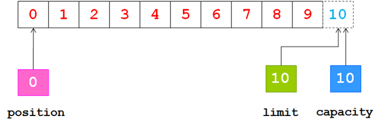
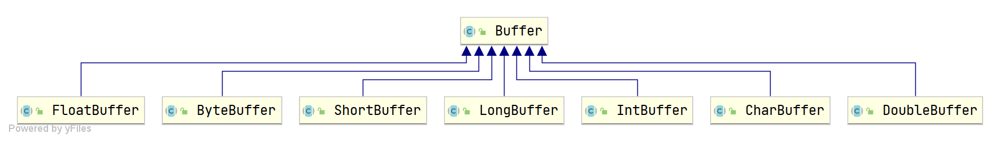

# Buffer

[buffer详解](https://segmentfault.com/a/1190000006824155)

[Buffer缓冲区理解1](https://blog.csdn.net/wuxianglong/article/details/6612246)

[Buffer缓冲区理解2](https://blog.csdn.net/qq_26855461/article/details/108811983)

ChannelIO(NIO)有三大核心部分: **Buffer**(缓冲区), **Channel**(通道), **Selector**(选择器)

​		

在StreamIO中(如`BufferedInputStream`和`BufferedReader`)直接使用数组作为用户缓冲区, 在NIO包中Java使用`Buffer`作为用户缓冲区. 但实际都是在**内存中开辟一块内存, 用来做`输入/输出`的临时存储**

>   大概是为了可以更好的操作用户缓冲区吧. 直接操作数组比较麻烦

​		

## 核心属性

*   **position**

    下一个读或者写的索引. 每次读写自动改变. 取值范围为`0 <= position <= limit`

*   **limit**

    可读或者可写的最大值. 取值范围为`0 <= limit <= capacity`

*   **capacity**

    最大容量. 初始化时决定

*   **mark**

    标记位. 使用`mark()`来设置`mark = position`, 再次调用`reset()`让`position`恢复到标记位



>   `ByteBuffer.allocate(10)`的初始情况
>
>   因为索引从0开始, 所以10是不存在的


```java
// 核心属性理解
public static void main(String[] args) {
    try (FileChannel file = FileChannel.open(Paths.get("F:\\2.txt"),
            StandardOpenOption.WRITE, StandardOpenOption.TRUNCATE_EXISTING)) {

        CharBuffer buffer = CharBuffer.allocate(10);

        output("初始化", buffer);

        buffer.put('a');
        buffer.put("\uD869\uDF00");
        output("添加数据", buffer);

        buffer.flip();
        output("flip", buffer);

        System.out.println(buffer.get());
        output("get", buffer);

        buffer.position(0);
        file.write(Charset.defaultCharset().encode(buffer));
        output("write", buffer);

        buffer.clear();
        output("clear", buffer);

    } catch (IOException e) {
        e.printStackTrace();
    }
}

public static void output(String step, Buffer buffer) {
    System.out.println(step + " : ");
    System.out.print("capacity: " + buffer.capacity() + ", ");
    System.out.print("position: " + buffer.position() + ", ");
    System.out.println("limit: " + buffer.limit());
    System.out.println();
}
```


## 核心方法

[Buffer的flip，rewind，clear等操作](https://www.jianshu.com/p/92e7b4d2a0b5)

```java
/**
 * 将写模式转换为读模式
 * limit设置为当前写的位置(表示能读多少个). 然后将position置为0
 */
public final Buffer flip() {
    limit = position;
    position = 0;
    mark = -1;
    return this;
}

/**
 * 倒带或者说重置
 * 将下标置为0, 可以重新写入或读取
 */
public final Buffer rewind() {
    position = 0;
    mark = -1;
    return this;
}

/**
 * 重置缓冲区
 */
public final Buffer clear() {
    position = 0;
    limit = capacity;
    mark = -1;
    return this;
}

/**
 * 压缩. 
 * 将Buffer中已读的部分丢弃. 并转为写模式
 */
public ByteBuffer compact() {
    // DirectBuffer和HeapBuffer实现有些不同. 但都差不多Direct操作的是内存. Heap则是数组
    // DirectBuffer更好理解. 这里贴的是DirectBuffer的
    int pos = position();
    int lim = limit();
    assert (pos <= lim);
    int rem = (pos <= lim ? lim - pos : 0);

    unsafe.copyMemory(ix(pos), ix(0), (long)rem << 0);
    position(rem);
    limit(capacity());
    discardMark();
    return this;
}
```

​		

## allocateDirect()和allocate()

[allocateDirect和allocate的联系与区别](https://www.cnblogs.com/felixzh/p/12013017.html)

[Java魔法类：Unsafe应用解析](https://tech.meituan.com/2019/02/14/talk-about-java-magic-class-unsafe.html)

`ByteBuffer`中提供2种创建字节缓冲区的静态方法. 分别是

*   allocateDirect()

    由`allocateDirect()`创建生成的是`DirectByteBuffer`对象. 该对象在堆外分配内存

*   allocate()

    由`allocate()`创建生成的是`HeapByteBuffer`对象. 该对象本质是在堆内创建数组(分配内存). 

两者的区别是`HeapByteBuffer`对象创建快, 但IO慢. `DirectByteBuffer`与之相反. 

>   多了一次IO, JVM语言拷贝一般是先拷贝到JVM外, 然后在复制到JVM内

因此一般情况下建议使用`DirectByteBuffer`. 并减少创建次数, 尽量复用. 

​		


>   图上的是有缓存过后读取的大概时间
>
>   第一次没缓存的时候读大文件会非常慢, 读过一次之后会快很多(大概3-10倍). 图中的数值就是取多次读文件耗时平均值
>
>   在没有缓存时`DirectByteBuffer`和`HeapByteBuffer`差距并不大
>
>   无缓存读4G大小文件, 都用512KB缓存
>
>   `DirectByteBuffer`耗时10080 | 9159 (2次读写)
>
>   `HeapByteBuffer`耗时10400 |10137 (2次读写)

```java
// 耗时测试代码 文件是`一二三四五六七八九`和字符`;`和换行符的集合 凑到对应容量
public static void main(String[] args) {
    try (FileChannel file = FileChannel.open(Paths.get("D:\\测试大文件\\4G.txt"),
            StandardOpenOption.READ, StandardOpenOption.TRUNCATE_EXISTING)) {
        ByteBuffer buffer = ByteBuffer.allocateDirect(1024 * 1024 * 512);
 		// ByteBuffer buffer = ByteBuffer.allocate(1024 * 1024 * 512);

        long l = System.currentTimeMillis();
        while (file.read(buffer) != -1) {
            buffer.clear();
        }
        System.out.println((System.currentTimeMillis() - l));

    } catch (IOException e) {
        e.printStackTrace();
    }
}
```


​		

### DirectByteBuff创建方法解析

```java
DirectByteBuffer(int cap) {
    // ... 一些代码
    long base = 0;
    try {
        // 在堆外分配内存, 返回基地址
        base = unsafe.allocateMemory(size);
    } catch (OutOfMemoryError x) {
        Bits.unreserveMemory(size, cap);
        throw x;
    }
    // 内存初始化
    unsafe.setMemory(base, size, (byte) 0);
    
    // ... 一些代码
    // 跟踪DirectByteBuffer对象的垃圾回收, 已实现对外内存的释放
    cleaner = Cleaner.create(this, new Deallocator(base, size, cap));
    att = null;
}
```


### 杂

```java
/* ByteBuffer和CharBuffer互转 */

// CharBuffer转ByteBuffer
ByteBuffer byteBuffer = StandardCharsets.UTF_8.encode(charBuffer);
// 其他编码可以用 Charset.forName("UTF-8") 替代

// ByteBuffer转CharBuffer
CharBuffer charBuffer = StandardCharsets.UTF_8.decode(byteBuffer);
```




