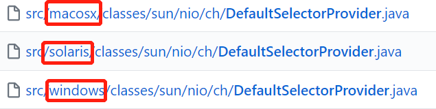

# Channel

[攻破JAVA NIO技术壁垒](https://honeypps.com/java/java-nio-quick-start/) 

[Java NIO 的前生今世 之二 NIO Channel](https://segmentfault.com/a/1190000006824107)

ChannelIO(NIO)有三大核心部分: **Buffer**(缓冲区), **Channel**(通道), **Selector**(选择器)

​		

Channel和Stream本质上应该是一个东西, 因为都是通过系统调用从内核空间中转移数据到用户空间中(存疑, 因为没有看到过有类似的博客, 但看Api是差不多的...)

和Stream的区别主要有以下几点

*   Channel可以同时兼具读写，Stream是单向的

*   特定的Channel可以是非阻塞的, Stream只能是阻塞的

    >   FileChannel阻塞, SocketChannel在配置了`configureBlocking(false)`的情况下非阻塞

*   Channel是基于Buffer读写, 而Stream是基于数组读写

    >   感觉Channel就是Stream在使用上优化了一点而已


​		

Channel中比较中要的几个实现

*   **FileChannel**

    文件的数据读写

*   **DatagramChannel**

    UDP的数据读写

*   **SocketChannel**

    TCP的数据读写(客户端)

*   **ServerSocketChannel**

    监听TCP链接请求(TCP服务端)


>   FileChannel有个`transferTo()`能将通道进行连接, 可以用于拷贝文件. 比循环一个`Channel`读取出来然后再循环写入另一个`Channel`好


## Channel继承关系图及作用

一般一个Channel接口对应一个功能, 如果先快速了解实现类有什么作用, 可以看它继承了那些接口

[AsynchronousFileChannel](https://ifeve.com/java-nio-asynchronousfilechannel/)

[SelectableChannel和GatheringByteChannel](https://www.cnblogs.com/chenpi/p/6483431.html)


## 各个系统的NIO实现

[JDK1.8](https://github.com/frohoff/jdk8u-jdk/find/master)

另外具体使用什么Channel和JDK(或者说系统)也是有关系的.

比如Linux和Win

   ```java
   /**
    * 以下代码win和Linux的一致. 
    * 但provider()返回值不一样. 也可以说SelectorProvider就不一样了.
    */
   public static SocketChannel open() throws IOException {
       return SelectorProvider.provider().openSocketChannel();
   }
   ```

下图所示是个版本JDK中`DefaultSelectorProvider`的路径. 

可以看到都是一致的. 但是一个系统只能安装各自版本的JDK. 所以生成的类按照系统是有区别的



```java
// linux中DefaultSelectorProvider的create()
// 可以看到按照具体系统的细分返回各自的Provider
public static SelectorProvider create() {
    String osname = AccessController
        .doPrivileged(new GetPropertyAction("os.name"));
    if (osname.equals("SunOS"))
        return createProvider("sun.nio.ch.DevPollSelectorProvider");
    if (osname.equals("Linux"))
        return createProvider("sun.nio.ch.EPollSelectorProvider");
    return new sun.nio.ch.PollSelectorProvider();
}

// win中DefaultSelectorProvider的create()
public static SelectorProvider create() {
    return new sun.nio.ch.WindowsSelectorProvider();
}
```

从上面代码可以看出. 按照个系统对JDK的不同实现可以返回不同的Provider.

这解答了我学习NIO前的一个疑问: NIO明明是有3种select, poll, epoll. 为什么Selector只有一个实现. 

原因就是JDK已经帮我们实现好了最优的NIO方案(epoll > poll > select(select还有必要吗?))


   

