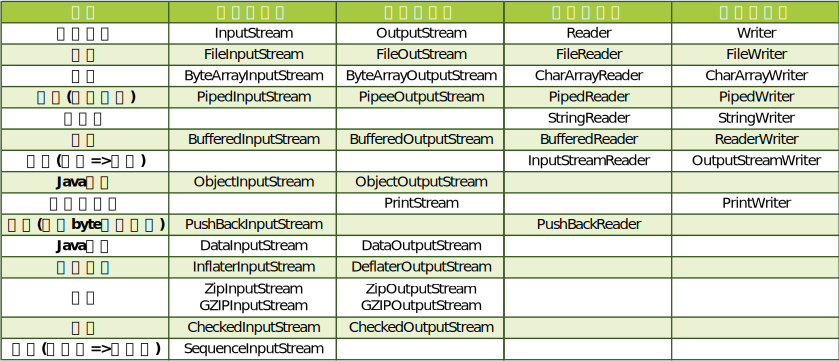

# StreamIO

[什么是IO](https://www.zhihu.com/question/67535292/answer/1728183629)

[流详解](https://www.cnblogs.com/happyone/p/12663145.html)

[流使用](https://juejin.cn/post/6844903985078337550#heading-12)

---

JavaIO类库基于抽象类`InputStream`和`OutputStream`构建的一套基于**字节**的IO体系

为了更好的解析字符, 还提供了基于抽象类`Reader`和`Writer`基于**字符**的IO体系

​		

Stream有以下三个特点

1.  **先进先出**

    最先写入输出流的数据最先被输入流读取到

2.  **顺序存取**

    不能随机访问流中间的数据(`RandomAccessFile`除外)

3.  **只读或只写**

    每个流只能是输入或者输出流中的一种. 不能同时具备2个功能



>   JavaIO相关的类很多, 图上面的只是列举了一部分较为常用的, 不必硬记. 需要时找得到就好

​		

## InputStream

```java
// skip()跳过用的缓冲区最大大小 => 因为跳过本质上是读取
private static final int MAX_SKIP_BUFFER_SIZE = 2048;

/**
 * 从数据中读取一个字节(0-255). 结尾时返回-1
 * 在返回或者抛出异常前此方法将阻塞
 */
public abstract int read() throws IOException;

/**
 * 从数据中读入一个字节的数组, 最多读入b.length个字节. 结尾时返回-1
 * 非结尾时返回存入数组b的字节数
 * 在返回或者抛出异常前此方法将阻塞(大概会,注释没有写)
 */
public int read(byte b[]) throws IOException {
    return read(b, 0, b.length);
}

/**
 * 从数据中读入一个字节的数组, 最多读入len个字节. off表示存入b的偏移量. 结尾时返回-1
 * 非结尾时返回存入数组b的字节数
 * 在返回或者抛出异常前此方法将阻塞(大概会,注释没有写)
 */
public int read(byte b[], int off, int len) throws IOException {
    // ...一些代码基本不会用 性能太慢了
}

// 跳过流中的n个字节. 返回实际上跳过的字节(可能到流末尾之类的)
public long skip(long n) throws IOException {
    // ...一些代码, 实际是内部读取n个字节
}

// 返回可读取的字节估计数
public int available() throws IOException {
    return 0;
}

// 关闭流并释放资源
public void close() throws IOException {}

/**
 * 给流当前位置打一个标记, 和reset()配合使用
 * readlimit表示在读取readlimit个字符后标记 可能 会失效
 * 流不一定支持该方法
 */
public synchronized void mark(int readlimit) {}

/**
 * 跳转回标志位, 和mark()配合使用
 * 123456789 > 开始读取前mark() -> 读取4位后reset() ->打印结果为:1234123456789
 */
public synchronized void reset() throws IOException {
    throw new IOException("mark/reset not supported");
}

// 判断是否支持mark()和reset()
public boolean markSupported() {
    return false;
}
```

​		

## OutputStream

```java
// 将b写入流中, 但注意的是只写入低8位, 其高24位将被丢弃(字节流嘛)
public abstract void write(int b) throws IOException;

// 给定字节数组b, 将b中的数据全部写入到此输出流中
public void write(byte b[]) throws IOException {
    write(b, 0, b.length);
}

/**
 * 给定字节数组b, 将b中的数据写入到此输出流中. 写入初始下标为off, 最多写入len个字节
 */
public void write(byte b[], int off, int len) throws IOException {
    // ...一些代码基本不会用 性能太慢了
}

// 刷新次输出流, 并强制写出所有缓冲的字节
public void flush() throws IOException {
}

// 关闭流并释放资源
public void close() throws IOException {
}
```

​		

## 一般使用

```java
try (FileInputStream fis = new FileInputStream("F:\\1.txt");
     BufferedInputStream bis = new BufferedInputStream(fis);
     // InputStreamReader reader = new InputStreamReader(bis)
) {
	// 缓冲区
    byte[] bytes = new byte[1024 * 2];
    StringBuilder str = new StringBuilder();

    int index;
    while ((index = bis.read(bytes)) != -1) {
        // 注意使用index做最大索引! 用bytes.length可能会存在脏数据
        for (int i = 0; i < index; i++) {
            str.append((char)bytes[i]);
        }
    }
    System.out.println(str.toString());
} catch (IOException e) {
    e.printStackTrace();
}
```

需要注意几点.

1.  优先使用字符流. 字节流一般用于读二进制文件(图片, 音频, 压缩包, word之类). 字符流的API比较人性化
2.  索引需要用`read()`方法的返回值, 不然可能会有脏数据
3.  适当增大缓冲区(byte[] bytes)可以减少`用户态=>内核态=>用户态`的状态切换

>   本来还想写下各个子类流的用法, 看过一些之后又感觉没必要了...和基类的使用差不多(压缩, 合并可能有点差距) . 到时需要再百度吧...

​		

## Reader

[Reader/Writer注释](https://www.cnblogs.com/moonfish1994/p/10222416.html)

```java
/**
 * 声明一个Object对象，为后续方法进行同步操作时，提供同步锁.
 * (大概因为字符流需要操作多个字节, 如果读取时其他线程也进行读取则会出现读取到半个字符的现象吧)
 * lock对象一般指定为自身Stream对象, 也可以因为性能优化将锁对象赋值给lock
 */
protected Object lock;

// 从流中读取数据存放到target中, 非结尾时返回写入的字节数, 结尾时返回-1.
public int read(java.nio.CharBuffer target) throws IOException {
    // 字符缓冲区中可以使用的元素数量, 将其作为临时字符数组的长度
    int len = target.remaining();
    char[] cbuf = new char[len];
    int n = read(cbuf, 0, len);
    if (n > 0)
        // 读取数据后，将字符数组中的数据全部置于字符缓冲区中
        target.put(cbuf, 0, n);
    return n;
}

public int read() throws IOException {
    // ...实际上使用read(char cbuf[], int off, int len)
}

public int read(char cbuf[]) throws IOException {
    // ...实际上使用read(char cbuf[], int off, int len)
}

/**
 * 从数据中读入一个字符的数组, 最多读入len个字节. off表示存入cbuf的偏移量. 结尾时返回-1
 * 非结尾时返回存入数组cbuf的字符数
 * 在返回或者抛出异常前此方法将阻塞(大概会,注释没有写)
 */
abstract public int read(char cbuf[], int off, int len) throws IOException;

// skip()跳过用的缓冲区最大大小 => 因为跳过本质上是读取
private static final int maxSkipBufferSize = 8192;

// skip()跳过用的缓冲区
private char skipBuffer[] = null;

// 跳过流中的n个字节. 返回实际上跳过的字节(可能到流末尾之类的)
public long skip(long n) throws IOException {
    // ...一些代码, 实际是内部读取n个字节
}

// 检查流是否可以被读取
public boolean ready() throws IOException {
    return false;
}

// 检查是否可以支持mark()和reset()
public boolean markSupported() {
    return false;
}

/**
 * 给流当前位置打一个标记, 和reset()配合使用
 * readlimit表示在读取readlimit个字符后标记 可能 会失效
 * 流不一定支持该方法
 */
public void mark(int readAheadLimit) throws IOException {
    throw new IOException("mark() not supported");
}

/**
 * 跳转回标志位, 和mark()配合使用
 * 123456789 > 开始读取前mark() -> 读取4位后reset() ->打印结果为:1234123456789
 */
public void reset() throws IOException {
    throw new IOException("reset() not supported");
}

// 关闭流并释放资源
abstract public void close() throws IOException;
```


## Writer

```java
// 临时缓冲区，用于保存字符串和单个字符的写入
private char[] writeBuffer;

/**
 * 该值为存放写出数据的字符数组writeBuffer的初始容量，默认为1024
 */
private static final int WRITE_BUFFER_SIZE = 1024;

/**
 * 声明一个Object对象，为后续方法进行同步操作时，提供同步锁.
 * (大概因为字符流需要操作多个字节, 如果读取时其他线程也进行读取则会出现读取到半个字符的现象吧)
 * lock对象一般指定为自身Stream对象, 也可以因为性能优化将锁对象赋值给lock
 */
protected Object lock;

// 写一个字符. 但注意的是只写入低16位, 其高16位将被丢弃
public void write(int c) throws IOException {
    synchronized (lock) {
        if (writeBuffer == null){
            writeBuffer = new char[WRITE_BUFFER_SIZE];
        }
        writeBuffer[0] = (char) c;
        write(writeBuffer, 0, 1);
    }
}

// 写入一个字符数组
public void write(char cbuf[]) throws IOException {
    write(cbuf, 0, cbuf.length);
}

// 写入一个字符数组, 将cbuf中的数据写入到此输出流中. 写入初始下标为off, 最多写入len个字节
abstract public void write(char cbuf[], int off, int len) throws IOException;

// 写一个字符串
public void write(String str) throws IOException {
    write(str, 0, str.length());
}

// 写一个字符串, 将str中的数据写入到此输出流中. 写入初始下标为off, 最多写入len个字节
public void write(String str, int off, int len) throws IOException {
    synchronized (lock) {
        char cbuf[];
        if (len <= WRITE_BUFFER_SIZE) {
            if (writeBuffer == null) {
                writeBuffer = new char[WRITE_BUFFER_SIZE];
            }
            cbuf = writeBuffer;
        } else {    // Don't permanently allocate very large buffers.
            cbuf = new char[len];
        }
        str.getChars(off, (off + len), cbuf, 0);
        write(cbuf, 0, len);
    }
}

// 将给定的字符序列全部写到流中
public Writer append(CharSequence csq) throws IOException {
    if (csq == null)
        write("null");
    else
        write(csq.toString());
    return this;
}

// 将给定的字符序列写到流中, start为开始写入的下标 end为结束下标
public Writer append(CharSequence csq, int start, int end) throws IOException {
    CharSequence cs = (csq == null ? "null" : csq);
    write(cs.subSequence(start, end).toString());
    return this;
}

// 将给定字符添加到流中
public Writer append(char c) throws IOException {
    write(c);
    return this;
}

// 刷新次输出流, 并强制写出所有缓冲的字节
abstract public void flush() throws IOException;

// 关闭流并释放资源
abstract public void close() throws IOException;
```

对于字节和字符的转换之前有几个疑问, 经过一些测试之后得出了一些结论, 不过不知道对不对.... 

1.  `UTF-8`编码的文件读取到java到底是几个字符?

    >   编码和字符集的关系: 编码=>字典目录. 字符集=>字典内容.
    >
    >   所以无论编码是什么. 占几个字节. 读取到Java内的就只会是`char`显示. 
    >
    >   因为有些`Unicode`是双字符的, 所以有些文字会占用2个`char`.

2.  如果双字符文字如果只读取到1个怎么办(比如: 缓冲区2字符. 有`a`和一个双字节字符`𪜀`那么读取到)? 如果恰好就需要判断那个文字呢? 

    >   如果第一个问题没有理解错的话. 那么可以使用`Character.isHighSurrogate(char ch)`这个方法判断本字符是否占两个字符. `isHighSurrogate()`还有一个关联方法`isLowSurrogate()`. 这2方法是用于判断是否是双字符开头和结尾.
    >
    >   如果恰好要判断那个文字的话应该正常判断就可以了, 前提是读取完成, 不能是半个.
    >
    >   比如:`"\uD869\uDF00".equals(x)`. 如果x是对应的文字也会返回true(当然...这本来就可以对比多文字的...)

