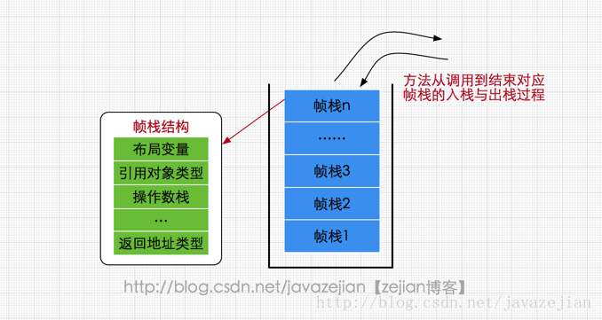

# JAVA内存区域与JAVA内存模型

首先要清楚的是**java内存区域**和**java内存模型**的划分是*不同层次的概念*

*   **java内存区域** : java虚拟机在程序运行时会自动将内存划分为: 方法区, 堆, <u>虚拟机栈, 本地方法栈, 程序技术器</u>(下划线代表线程私有)
*   **java内存模型** : 本身是一种抽象的概念, 它描述了一种规则. 这种规则定义了程序中各个变量的访问方式

 

## java内存区域

 java虚拟机在程序运行时会自动将内存划分

*   **方法区** : 

    又称为非堆(Not-Heap), 静态区, 永久代(1.8移除), 元空间(1.8)
    主要储存以被加载的 **类, 常量, 静态变量, 即时编译器编译的代码**

    >   元空间和永久代实际都是对JVM中方法区的实现
    >
    >   元空间与永久代最大的区别在于: 元空间不在虚拟机内存中, 使用本地内存

    其中有个运行时常量池, 储存 各种*字面变量和符号引用*

    字符串常量池 于 1.7中移到了堆中

     

*   **堆** :

    又被成为GC堆

    主要储存 **对象和数组** ,几乎所有对象和实例都在这里分配

    >   从内存回收角度看, 堆可以分为 **新生代**, **老年代**, **永久代**
    >
    >   从内存分配角度看, 堆可以划分出多个线程私有的分配缓冲区, 但储存的还是对象和数组

     

*   **虚拟机栈** : 

    随线程创建而创建, 生命周期和线程一致

    用于储存栈帧

    >   栈帧 : 方法执行时创建, 储存方法的 变量, 返回值, 返回地址....等

    调用一个方法创建一个栈帧, 将栈帧压入虚拟机栈中. 执行完栈帧出栈

    

     

*   **程序计数器**

    又被称为PC 寄存器

