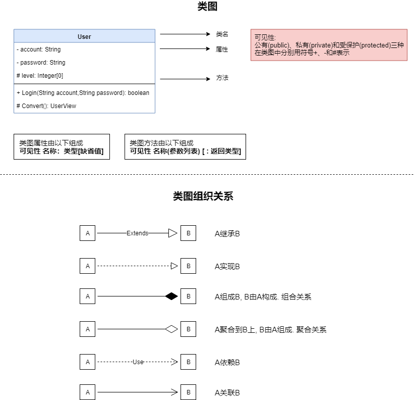

# 简单看懂软件类图

[参考1: 大体认识](https://www.cnblogs.com/EltonLiang/p/6562270.html)   [参考2: 类组织关系](https://www.cnblogs.com/noteless/p/9907703.html)

[参考3: 类关系_复杂](https://blog.csdn.net/monkey_d_meng/article/details/6005764)   [参考4: 类关系_简单](https://www.cnblogs.com/pluviophile/p/7542017.html)

