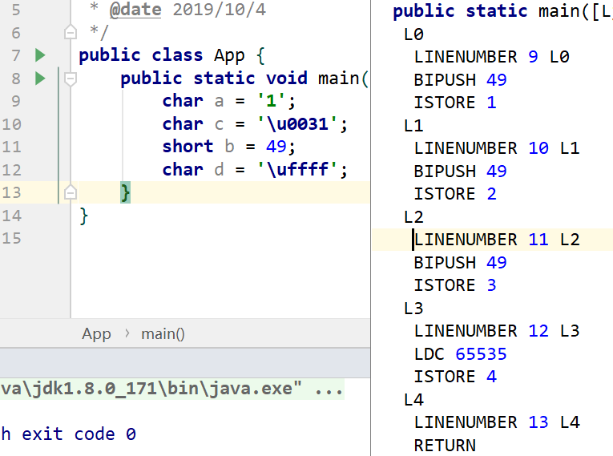

## 进制换算与char与String

[java基本数据类型各占多少字节](http://www.luyixian.cn/news_show_16188.aspx)

[java中 int、char、long各占多少字节数](https://blog.csdn.net/qq_31615049/article/details/80574551)

[字节与字符换算](https://blog.csdn.net/qq_39251267/article/details/80194285)

[byte与bit之间的转换](http://www.javacui.com/Theory/268.html)

[Java中boolean类型占用多少个字节](https://blog.csdn.net/qq_35181209/article/details/77016508)

[java中boolean类型占用字节判断方法](https://www.iteye.com/problems/88825)

[进制在线转换](https://cunchu.51240.com/)

[汉字 Unicode 编码范围](https://www.qqxiuzi.cn/zh/hanzi-unicode-bianma.php)


-------

总是记不住啊= =


由小到大

*   bit(位, 比特)
*   byte(字节)
*   KB
*   MB

8 bit = 1 byte

1024 byte = 1KB


----------

在java中基本类型由小到大

*   byte (1字节) (-2^7^ - 2^7^-1) (-128 - 127)

*   char | short (2字节) (-2^15^(-32768 ) -  2^15^-1(32767)) (**\u0000** - **\uffff**)

*   int | float (4字节) (-2^31^ -  2^31^-1) 

*   long | double (8字节) (-2^63^ -  2^63^-1)

*   boolean 逻辑上占1 byte 但具体实现要看虚拟机, 

    >   上面参考的设置虚拟机最大值, 然后创建一个数组, 如果溢出了就表示存的是int. 感觉是错的
    >
    >   第一int4个字节, 那么占10mb的话应该是[256 * 1024 * 10], 不是[1024 * 1024 * 10]. 而且试了几次虚拟机要-Xmx15m -Xms15m 才不会溢出(14溢出), 并不是11
    >
    >   后面看字节码文件, boolean a = false; 的字节码是 ICONST_0 和 int a = 0; 是一样的

>   [!notice]
>
>   java中的基本类型所占内存是固定的, 这种不变性是java比其他语言更具可移植性的原因之一


## short丶char丶String

查看了下字节码发现char 用的是short的字节码

```java
char a = '1';
short b = 49;
char a = (char)49;
// 字节码文件都是 BIPUSH 49
```

又想到short和char 最大长度是 2^7^*2 = 65536 和Unicode是一致的, 不知道这3个的关系是怎样

而且 字节码文件中 char和short共用, 如果char存的是32767(2^15^) 那还是用 **BIPUSH** ? 




char只能存65536个字符, 可是汉字还有其他语种的文字那么多65536一看就不够

>   原本java中char用2个字节是可以包含Unicode规范的, 可是后来Unicode扩展了...总感觉被坑了

所以一些字是不能保存在char中的, 如: 𪜀 , 这个字一复制到idea就自动转为: \uD869\uDF00

>   [StreamIO](../../IO/StreamIO/StreamIO.md)中还有些对字符的猜想

用2个char来保存一个字, 不知道内置是如何实现的

>   大概使用一些预留的char来表示要查看下一个字符来确定, 
>
>   如: 𪜁 , 这个字符对应的char为: \uD869\uDF01, 第一个都是\uD869
>
>   这个字符很有意思, 字节码文件是: LDC 55401, 转字符输出是: ?. 可是? 的字节码是 BIPUSH 63
>
>   还有. 𪻏的char为: \uD86B\uDECF. 这个\uD86B 转字符输出也是: ?
>
>   这就有理由相信这类型char的都是预留的

[这样实现的](https://www.zhihu.com/question/63031746/answer/204896541), 和[这样](https://www.cnblogs.com/yaowen/p/8862221.html)的. 留个坑后面看. 编码转换理解起来好麻烦...又不太重要资料又少后续有机会再看吧

>   UTF-8中的特殊字符: a(1字节)虱(3字节)𪜀(4字节)


------

总结了一下感觉清晰多了

果然程序员和2^n^有千丝万缕的关系

本来只想记录下进制转换和基本数据类型的大小, 没想到引发出那么多= =


## INT

[int为什么不是2的32次方](https://blog.csdn.net/u011983111/article/details/78612360)

​		

为什么int的最大值是`2^31 - 1(0x7FFFFFFF)` ? 

**还有个符号位啊!** 

如果没有符号位的话那么最大值确实是`2^32 - 1`

​		

为什么是`2 ^ 32 - 1`? 

因为INT使用32位(4字节)(`FF FF FF FF` )存储, 

而`2^32` 16进制为 `1 00 00 00 00` . 比INT.Max还要大1

而且`2 ^ 32` = `2 << 31` 左移补0. 哪有最大值右边还有0的....(吐槽自己)

>   一直迷糊的我...


