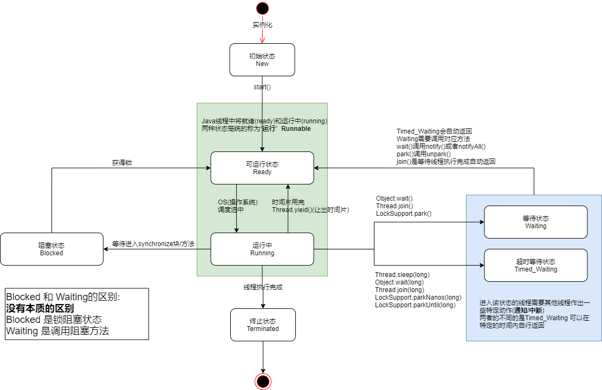

# 线程状态

[Java线程的6种状态分析](https://www.jianshu.com/p/ec94ed32895f)

[线程的状态(比较简洁)](https://www.liaoxuefeng.com/wiki/1252599548343744/1306580742045730)

[Java线程的5种状态及切换(透彻讲解)-京东面试](https://www.cnblogs.com/aspirant/p/8900276.html)

[Java线程的6种状态及切换(透彻讲解)](https://blog.csdn.net/pange1991/article/details/53860651)

[Java Thread.join()详解](https://www.jianshu.com/p/595be9eab056)

[thread.join](https://my.oschina.net/u/3847203/blog/2251797)

[Java中LockSupport.parkNanos与Sleep的区别是什么？](https://www.zhihu.com/question/62274881)

---


## 线程的6种状态

以`java.lang.Thread.State` 这个类为准

>   操作系统是5种, java本身没有线程, java创建线程是调用操作系统

```java
public enum State {
    // 尚未启动的线程的线程状态。
    NEW,
    // 可运行的线程, 但需要其他系统资源才能运行, 比如CPU时间片(大概是这个意思)
    RUNNABLE,
    // 阻塞状态, 处于阻塞的线程会等待以获取锁的方法块释放锁
    BLOCKED,
    /**
     * 等待状态, 处于等待另一个线程执行特定操作的状态
     * 由于调用了以下方法的其中一个而处于等待状态
     * Object.wait() / Thread.join() / LockSupport.park()
     * 需要其他线程调用
     * Object.notify(), Object.notifyAll()/  /LockSupport.unpark();
     */
    WAITING,
    /**
     * 具有等待时间的等待状态
     * 调用以下方法中的一个进去该状态
     * Thread.sleep(long) / Object#wait(long) / Thread.join(long) 
     * LockSupport.parkNanos / LockSupport.parkUntil
     */
    TIMED_WAITING,
    /**
     * 终止状态, 线程执行完成
     */
    TERMINATED;
}
```


## 线程调度状态图





