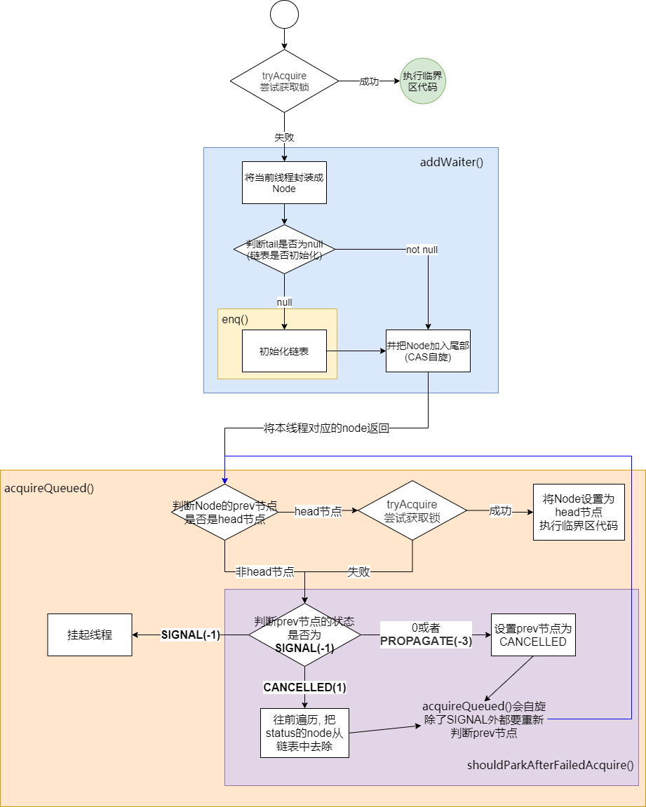

# AQS

[图解AQS原理之ReentrantLock详解-非公平锁](https://www.cnblogs.com/dwlsxj/p/reentrantlock-principle-nonfairsync.html)

[Java并发之AQS源码分析（一）](https://cloud.tencent.com/developer/article/1446028)

[AbstractQueuedSynchronizer源码解读](https://www.cnblogs.com/micrari/p/6937995.html)

AbstractQueuedSynchronizer简称AQS

**是java中用于解决多线程并发访问共享资源中同步问题的基本框架**

子类实现看[这里](../../内置工具类/Lock/Summary.md)

AQS是CLH的一个变种, 在内部使用state来表示锁状态, 并维护一个FIFO的双向链表实现线程间的竞争和等待

>   源码类的笔记真是难写, 写多了太复杂, 写少了不清楚

​		

---

AQS核心属性

```java
// 链表头结点,head表示已经获取锁的线程
private transient volatile Node head;

// 链表尾节点
private transient volatile Node tail;

// 锁状态 0为无锁, >0表示重入次数
private volatile int state;
```

AQS暴露的接口, AQS提供独占(互斥锁)和非独占(读写锁)2种模式

```java
// 尝试获取锁
tryAcquire()/tryAcquireShared();

// 尝试释放锁
tryRelease()/tryReleaseShared();

// 是否是独占模式
isHeldExclusively()
```

​	

只是关注AQS的属性和方法还不够, 还需要关注一个内部类Node(链表的属性)

```java
// node的状态, 理解了这个状态就基本理解了, 下面详细讲
volatile int waitStatus;

// node的上/下一个节点
volatile Node prev/next;

// node锁关联的线程, 获取到锁后就置为null将thread保存到AbstractOwnableSynchronizer.exclusiveOwnerThread中
volatile Thread thread;
```

​	

**waitStatus有5种状态**, 看注释和博客感觉解释很乱, 没有全面了解的会很晕:

*   1 (**CANCELLED**)

    取消状态.  这个状态的Node已经没必要获取锁了需要从链表移除. 2种方式可以让线程达到这个状态:

    1.  线程调用`tryAcquireNanos()`(带超时的获取锁方法), 获取锁超时了
    2.  线程调用`tryAcquireNanos()`获取锁时调用`interrupt()`

*   -1 (**SIGNAL**)

    等待触发状态. 

    表示: 当前节点存在子节点, 且已经子节点已经park

*   -2 (**CONDITION**)

    等待条件状态. 当前节点在等待condition, 即在condition队列中

*   -3 (**PROPAGATE**)

    共享模式专用状态, 表示状态需要向后传播

    向后传播个人理解是: 一个过渡状态, 表示后一个node需要多自旋一次. 具体看[这里](./AQS.md#waitstatuspropagate的作用)

*   0 初始状态

     有2种可能

    1.  没有后续节点
    2.  后续节点正在运行中(没有执行到`compareAndSetWaitStatus(pred, ws, Node.SIGNAL);`)


​		

---


## 一个简单的概括

[IntelliJ IDEA - Debug 调试多线程程序](https://blog.csdn.net/nextyu/article/details/79039566)

AQS会构造一个显式链表, 其头结点为正在执行的线程

>   唤醒 != 拿到锁. 唤醒执行触发一次获取锁的尝试!

​		

互斥模式下:

*   加锁(**acquire**): 

    新线程进入时会获取尝试锁一次(<u>tryAcquire</u>)

    获取失败后会加入到链表的尾部(addWaiter)

    在进入休眠前或做2个操作(acquireQueued): 

    1.  判断prev是否为head是就再尝获取一次(tryAcquire) 成功则直接执行临界区代码
    2.  获取prev的状态并修改为-1, 如果prev为1则会把prev移出链表(shouldParkAfterFailedAcquire)

*   解锁(**release**):

    尝试解锁(<u>tryRelease</u>)

    解锁成功且链表存在next节点则唤醒后续节点(unparkSuccessor). 特别的是如果head对应的next节点不存在或waitStatus=1 则从tail开始唤醒


​			

共享模式下:

>   共享模式比独占模式难, 因为**独占模式<u>tryAcquire</u>之后的逻辑和release是单线程的!**
>
>   共享模式太复杂了建议用Semaphore信号量+IDEA多线程debug理解

*   加锁(**acquireShared**)

    线程进入时会尝试获取一次锁(<u>tryAcquireShared</u>)

    获取失败后会加入到链表的尾部(addWaiter)

    在进入休眠前或做2个操作(doAcquireShared): 

    1.  判断prev节点是否为head节点, 是就再尝尝获取一次(<u>tryAcquireShared</u>), 则判断是否有next以及next是否为share模式(setHeadAndPropagate), 如果是则唤醒next
    2.  获取prev的状态并修改为SIGNAL(-1), 如果prev为CANCELLED(1)则会把prev移出链表(shouldParkAfterFailedAcquire)

*   解锁(**releaseShared**)

    尝试解锁(<u>tryReleaseShared</u>)

    唤醒下一线程(doReleaseShared). **这里会有2种情况(对应doReleaseShared的if-else)**

    1.  下一线程已经park. 此时head.waitStatus = -1

        将head.waitStatus修改为0

        >   目的是如果next线程还未挂起就让next线程多尝试一次. 线程挂起和唤醒消耗资源多

        此时需要唤醒下一线程`unparkSuccessor(h);`

    2.  下一线程还未park(正在运行). 此时head.waitStatus = 0

        此时下一线程还在运行, 并且肯定未执行到`shouldParkAfterFailedAcquire().compareAndSetWaitStatus(pred, ws, Node.SIGNAL);`(起码在ws == 0时还没有执行)

        因为next和head都没有休眠所以`compareAndSetWaitStatus`可能会发生竞争

        >   竞争胜利继续执行, 失败重新自旋

        1.  head胜利的情况

            head.waitStatus改为-3(Node.PROPAGATE)

            head线程: 退出循环

            next线程: 竞争失败重新自旋(重新尝试获取锁!)

        2.  next胜利的情况

            head.waitStatus改为-1(Node.SIGNAL)

            next线程: 再执行一次自旋尝试获取锁, 获取失败则park
    
            head线程: continue本次自旋, 重新开始一次新的自旋
    

```java
// doReleaseShared
for (;;) {
    Node h = head;
    if (h != null && h != tail) {
        int ws = h.waitStatus;
        /**
         * 情况1 next大概率已经park (有可能next还未执行到park, 只是刚cas完)
         * 需要唤醒线程
         */
        if (ws == Node.SIGNAL) {
            // 有可能next还未挂起, cas把-1改为0, 让next重新执行一次
            // 考虑失败的情况是因为在共享状态下可能会存在多个线程操作head节点!
            if (!compareAndSetWaitStatus(h, Node.SIGNAL, 0))
                continue;
            unparkSuccessor(h); // 唤醒线程
        }
        /**
         * 情况2 next还未park
         * head和next可能会发生竞争
         * head: compareAndSetWaitStatus(h, 0, Node.PROPAGATE))
         * next: compareAndSetWaitStatus(pred, ws, Node.SIGNAL)
         * 竞争失败的自旋
         */
        else if (ws == 0 &&
                 // 这里会和shouldParkAfterFailedAcquire发生竞争
                 !compareAndSetWaitStatus(h, 0, Node.PROPAGATE))
            continue;
    }
    if (h == head)
        break;
}


// shouldParkAfterFailedAcquire
int ws = pred.waitStatus;
if (ws == Node.SIGNAL)
    return true;
if (ws > 0) {
    // 不重要
} else {
    // 这里会和doReleaseShared发生竞争!!!
    compareAndSetWaitStatus(pred, ws, Node.SIGNAL); 
}
return false;
```

​			

​			

---


## 总结

AQS 只是一个同步**框架**, 在内部构建了一个链表维护等待线程的有序性, 其获取锁的细节通过暴露的抽象方法完成! 

所以AQS没有公不公平一说, 公平性由子类实现

>   非公平性体现在任意线程进入时都会尝试获取锁. 如果想要公平锁则在队列不为空时线程初次获取锁应该总是获取失败


---


## unparkSuccessor方法

[Java AQS unparkSuccessor 方法中for循环为什么是从tail开始而不是head](https://www.freesion.com/article/83271361280/)

```java
private void unparkSuccessor(Node node) {
    Node s = node.next;
    // 当next为null或next.waitStatus>0就从tail开始唤醒
    if (s == null || s.waitStatus > 0) { 
        s = null;
        for (Node t = tail; t != null && t != node; t = t.prev)
            if (t.waitStatus <= 0)
                s = t;
    }
    if (s != null)
        LockSupport.unpark(s.thread);
}
```

需要从入队操作方法开始看

从`enq()`可以看到node的入队分别有3步

1.  node	=prev>     t
2.  tail        =指向>     node
3.  t            =next>     node

在高并发下可能会出现node.next=null. 可是tail已经有新节点的情况

```java
private Node enq(final Node node) {
    for (;;) {
        Node t = tail;
        if (t == null) { // Must initialize
            if (compareAndSetHead(new Node()))
                tail = head;
        } else {
            node.prev = t;
           	// 问题出在下面的if代码块中
            if (compareAndSetTail(t, node)) {
                t.next = node;
                return t;
            }
        }
    }
}
```


## waitStatus=PROPAGATE的作用

[IntelliJ IDEA - Debug 调试多线程程序](https://blog.csdn.net/nextyu/article/details/79039566)

[AQS 为什么需要 PROPAGATE? - 李洋的回答 - 知乎](https://www.zhihu.com/question/295925198/answer/1222807098) 

[面试官问我AQS中的PROPAGATE有什么用？](https://www.jianshu.com/p/a9fa17c2f23b)

在1.6版本时PROPAGATE是不存在的是为了解决一个bug. 
概括讲就是: **在共享模式下, 单纯靠tryAcquireShared()的返回值不足以判断是否需要传播唤醒(可能同时有多个acquire和release在进行), 需要再引入一个状态**

​		

主要用在`setHeadAndPropagate()`的判断中.

当propagate > 0 | oldHead.waitStatus < 0 | new waitStatus < 0 时就执行` doReleaseShared()`

```java
private void setHeadAndPropagate(Node node, int propagate) {
    Node h = head;
    setHead(node);
    // 用在下面的判断中
    if (propagate > 0 || h == null || h.waitStatus < 0 ||
        (h = head) == null || h.waitStatus < 0) {
        Node s = node.next;
        if (s == null || s.isShared())
            doReleaseShared();
    }
}
```


​		

唯一设置waitStatus=PROPAGATE的地方在共享锁释放锁时(`doReleaseShared()`)

```java
private void doReleaseShared() {
    for (;;) {
        Node h = head;
        if (h != null && h != tail) {
            int ws = h.waitStatus; // 注意这句
            if (ws == Node.SIGNAL) {
                if (!compareAndSetWaitStatus(h, Node.SIGNAL, 0))
                    continue; 
                unparkSuccessor(h);
            }
            else if (ws == 0 &&
                     // 唯一一个设置waitStatus=PROPAGATE的地方
                     !compareAndSetWaitStatus(h, 0, Node.PROPAGATE))
                continue;
        }
        if (h == head) 
            break;
    }
}
```


在`doReleaseShared()`中如果ws=0如果不设置ws=PROPAGATE会导致什么问题? 

1.  如果ws=0, 直接退出自旋

    *   假设next线程在运行中: 

        执行`setHeadAndPropagate()`的时候可能会导致不会唤醒后续线程(waitStatus均为0, propagate也为0的时候).(**少唤醒一个线程**)

    *   假设next线程已经park(ws是脏数据`int ws = h.waitStatus;`): 

        因为next线程已经park. 当前线程认为没有next线程或next线程正在运行中. 所以会导致**链表阻塞**

2.  如果ws=0, 设置ws=-1

    *   假设next线程在运行中: 

        next线程执行`shouldParkAfterFailedAcquire(p, node)`时直接就挂起了, **链表阻塞**


​		

>   共享模式下AQS的复杂程度是独占模型的几倍= =. 看不懂的推荐直接多线程debug

​		

​		

## lock主流程

```java
public final void acquire(int arg) {
    if (!tryAcquire(arg) &&
        acquireQueued(addWaiter(Node.EXCLUSIVE), arg))
        selfInterrupt();
}
```

看明白了觉得都没必要写...画个图吧

需要注意的点

1.  AQS是对中断不敏感的, 调用interrupt()后不会马上唤醒, 还是要等到获取锁后才会传递中断信号
2.  `acquireQueued()`虽然在finally块判断了是否执行`cancelAcquire()`但是正常情况是不会在`acquireQueued()`执行的(在`tryAcquireNanos()`中执行)




