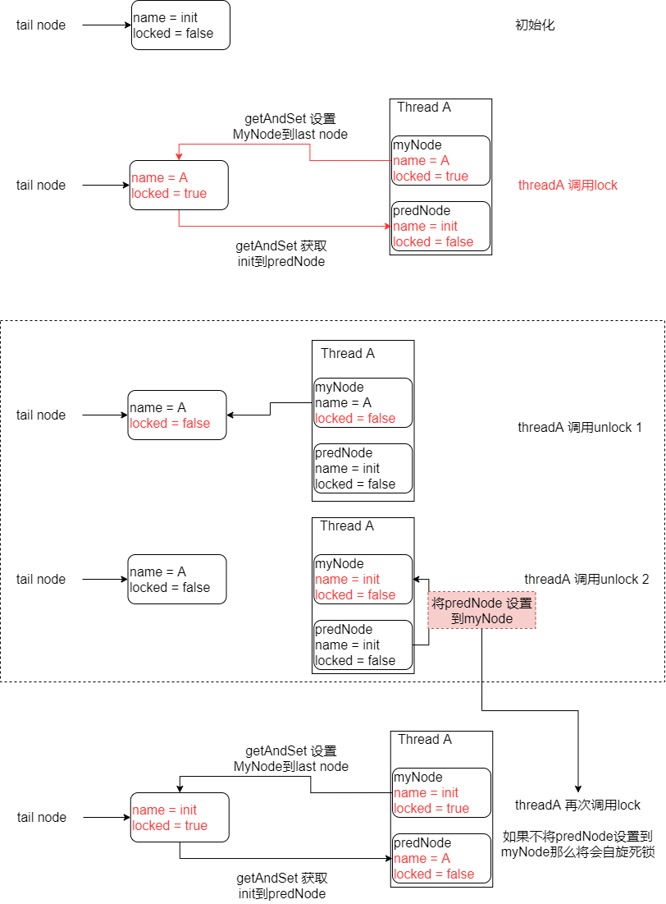

# Ticket_CLH_MCS

[排队式自旋锁思想启蒙](https://blog.csdn.net/lengxiao1993/article/details/108227584)

[CLH lock 原理及JAVA实现](https://www.cnblogs.com/shoshana-kong/p/10831502.html)

[AQS基础——多图详解CLH锁的原理与实现](https://juejin.cn/post/6864210697292054541#heading-6)

[Spin Lock, Ticket Spin Lock, MCS Spin Lock, CLH Spin Lock](https://www.cnblogs.com/milton/p/6710792.html)

---

​	

线程等待锁的方式:

*   **积极式等待**

    在等待时, 保持CPU的时间片, 在期间不断轮询锁状态并尝试获取锁(自旋)

*   **消极式等待**

    在等待时, 放弃CPU的时间片, 在锁释放前不会再次得到CPU资源


​	

自旋锁总览:

*   **普通自旋锁**

    当一个线程尝试获取锁时, 就一直循环检查锁的状态而不是挂起或者休眠

*   **Ticket锁**

    在普通自旋锁的基础上增加了排队机制保障公平性

*   **MCS锁**

    引入显式链表, 线程在**本节点**上自旋

*   **CLH锁**

    引入隐式链表, 线程在**前驱节点**上自旋

**MCS锁和CLH锁的最大区别在于自旋而不是链表**

​	

**自旋锁的缺点**([CAS](./CAS.md)):

*   因为自旋是通过CAS进行的而CAS底层是通过LOCK指令实现的. 所以自旋会导致频**繁锁定总线**

*   如果在临界区较大的情况, CAS会导致较多的**CPU资源浪费**在自旋上

*   如果抢占的线程较多会严重拖慢整体进程

    

自旋锁适用于线程较少, 临界区执行比较快速的情况


---


## 自旋锁

当一个线程尝试获取锁时, 就一直循环检查锁的状态而不是挂起或者休眠

线程会一直检查锁的状态`owner`是否为空, 为空就表示可以获取锁

```java
private static class SpinLock {
    private final AtomicReference<Thread> owner = new AtomicReference<>();

    private void lock() {
        Thread current = Thread.currentThread();
        while (!owner.compareAndSet(null, current));
    }
    private void unlock() {
        Thread current = Thread.currentThread();
        owner.compareAndSet(current, null);
    }
}
```

​	

​	

## Ticket

为了解决自旋锁不公平的问题

在自旋锁的基础上引入了一个虚拟队列, 达到了公平锁的效果

```java
private static class TicketLock {
    // 发票机
    private AtomicInteger ticketNum = new AtomicInteger(0);
    // 当前的票号
    private AtomicInteger owner = new AtomicInteger(0);
    // 当前线程的票号
    private static final ThreadLocal<Integer> myTicketLocal = new ThreadLocal<Integer>();

    public void lock() {
        int myTicket = ticketNum.getAndIncrement();
        myTicketLocal.set(myTicket);
        while (myTicket != owner.get());
    }

    public void unlock() {
        int myTicket = myTicketLocal.get();
        owner.compareAndSet(myTicket, myTicket + 1);
    }
}
```

​	

​	

## MCS

MCS是基于显示链表的公平自旋锁

申请线程只在本地变量上自旋, 由前驱节点通知其结束自旋, 减少缓存同步和总线占用

```java
private static class Node {
    volatile Node next;
    volatile boolean locked;
}

private static class MCSLock {
    // 初始node为null, 表示不用前驱节点通知直接获取锁, 所有线程共用
    AtomicReference<Node> tail = new AtomicReference<>(null);
    ThreadLocal<Node> myNode;

    public MCSLock() {
        myNode = ThreadLocal.withInitial(Node::new);
    }

    public void lock() {
        Node node = myNode.get();
        Node prev = tail.getAndSet(node);
        if (prev != null) {
            node.locked = true;
            prev.next = node;
            // 在本节点的locked上自旋
            while (node.locked);
        }
    }

    public void unlock() {
        Node myNode = this.myNode.get();
        if (myNode.next == null) {
            if (tail.compareAndSet(myNode, null)) {
                return;
            }
            // 有可能29行代码抢占失败, 并且执行到36的时候可能来不及挂载节点
            // 所以这里要自旋一下
            while (myNode.next == null);
        }
        // 通知下一个节点启动
        myNode.next.locked = false;
        myNode.next = null;
    }
}
```

>   最后一定要把node的连接断开, 不然的话GC就可能一直不回收

​	

​	

## CLH

基于隐式链表的公平自旋锁.

```java
private static class Node {
    volatile boolean locked;
}

private static class CLHLock {
    // 尾节点,所有线程共用
    private final AtomicReference<Node> tail;
    private final ThreadLocal<Node> myPred;
    private final ThreadLocal<Node> myNode;

    public CLHLock() {
        // 初始节点的locked默认为false, 表示下一线程可以马上获得锁
        this.tail = new AtomicReference<>(new Node());
        this.myNode = ThreadLocal.withInitial(Node::new);
        this.myPred = new ThreadLocal<>();
    }

    public void lock() {
        Node node = myNode.get();
        node.locked = true;

        Node prev = tail.getAndSet(node);
        myPred.set(prev);

        // 在前驱节点上自旋
        while (prev.locked) ;
    }

    public void unlock() {
        Node node = myNode.get();
        // 释放锁
        node.locked = false;
        // 把前驱节点替换到当前节点
        // 这样做的目的是防止自旋死锁 
        // 如果线程再次请求锁会导致myPred, myNode, tail都为一个对象
        // 当然也可以使用myNode.set(new Node())
        myNode.set(myPred.get());
    }
}
```

CLH的代码除了unlock的`myNode.set(myPred.get());` 这句之外都比较好懂

可以看下图在node上加了一个name帮助理解



​	

