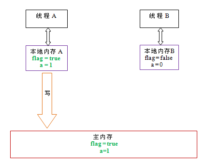
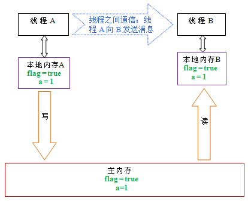
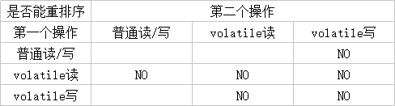
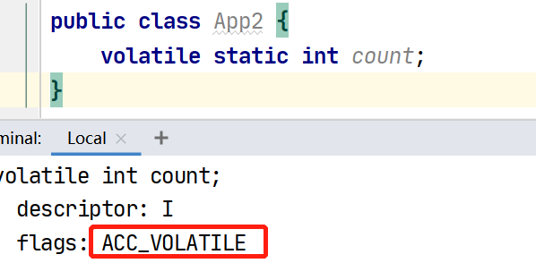
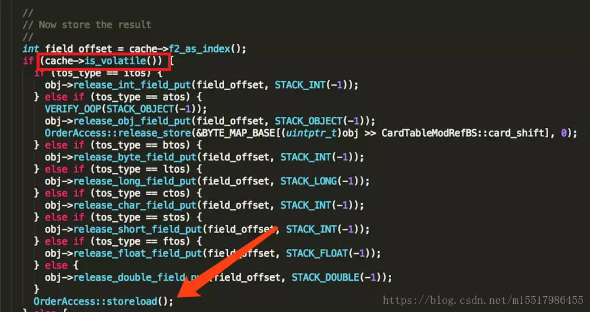
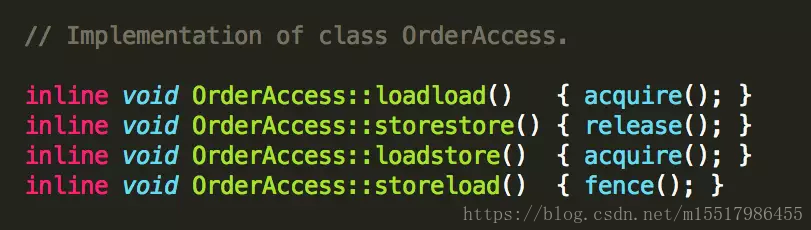
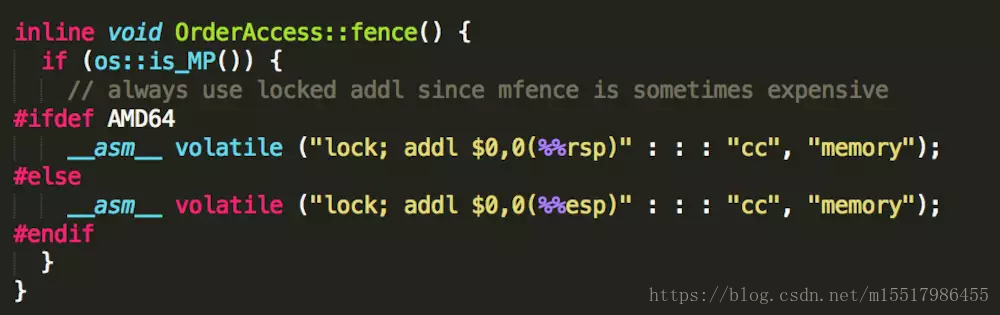

# volatile

[全面理解Java内存模型(JMM)及volatile关键字](https://blog.csdn.net/javazejian/article/details/72772461)

---

## volatile的作用

*   禁止指令重排
*   保证修饰变量在多线程下的可见性
*   保证对单个volatile变量的读/写具有原子性 

    ​	

---

​		

## volatile的内存语义

*   volatile写的内存语义:

    **当写一个volatile变量时, JMM会把该线程对应的本地内存中的共享变量的值刷新到主内存中**

*   volatile读的内存语义:

    **当读一个volatile变量时, JMM会把该线程对应的本地内存中设置为无效. 线程接下来将从主内存中读取共享变量**

>   读的时候应该是会把所有的共享变量设置为无效, 并发编程艺术中用下图做例子, 代码如下:
>
>   不全部失效的话不符合happens-before原则
>
>   ```java
>   int a = 0; volatile boolean flag = false;
>   public void writer() {
>       a = 1;
>       flag = true;
>   }
>   public void read() {
>       if(flag) {
>           int i = a;
>           ......
>       }
>   }
>   ```
>
>   
>
>   
>
>   


当线程A写一个volatile变量时, 实际上是对接下来将要访问该volatile变量的线程发出了消息

当线程B读一个volatile变量时, 实际上是线程B接收了之前某个线程发出的消息

​		

对volatile内存语义的总结:

当AB2个线程分别对volatile变量进行读写时, 其实就是线程A通过内存对线程B发送消息

>   Java内存模型里说的: JMM是通过读写共享内存进行隐式通讯的内存模型

---

​		

## volatile内存语义的实现

Java对于volatile的实现是通过添加内存屏障实现的

因为Java是跨平台语言, 所以要保持代码在各个平台上的实现保持一致, 所以就要采用比较保守的策略

*   对于volatile写

    StoreStore  =  *volatile写*  =  StoreLoad

*   对于volatile读

    *volatile读*  =  LoadLoad   =  LoadStore

>   针对并发编程艺术里的重排表总感觉有点问题
>
>   比如 普通读 - volatile写 为什么不能重排序到后面呢...
>
>   

---

​		

## 对于volatile中内存屏障的优化

```java
class VolatileBarrierExample {
    int a;
    volatile int v1 = 1;
    volatile int v2 = 2;
    void readAndWrite() {
        int i = v1; // 第一个volatile读
        int j = v2; // 第二个volatile读
        a = i + j; // 普通写
        v1 = i + 1; // 第一个volatile写
        v2 = j * 2; // 第二个 volatile写
	}
}
```

	

​		

---

​		

## volatile 底层实现

[volatile字节码到JVM](https://blog.csdn.net/m15517986455/article/details/83273723)



可以看到volatile的实现是通过flags: **ACC_VOLATILE**实现的

其中JVM会对变量的读写进行如下操作:

1.  判断是否有ACC_VOLATILE
2.  依据处理器架构加入内存屏障

判断是否存在ACC_VOLATILE

`hotspot/src/share/vm/interpreter/bytecodeInterpreter.cpp:1940`



`hotspot/src/os_cpu/linux_x86/vm/orderAccess_linux_x86.inline.hpp:35`






