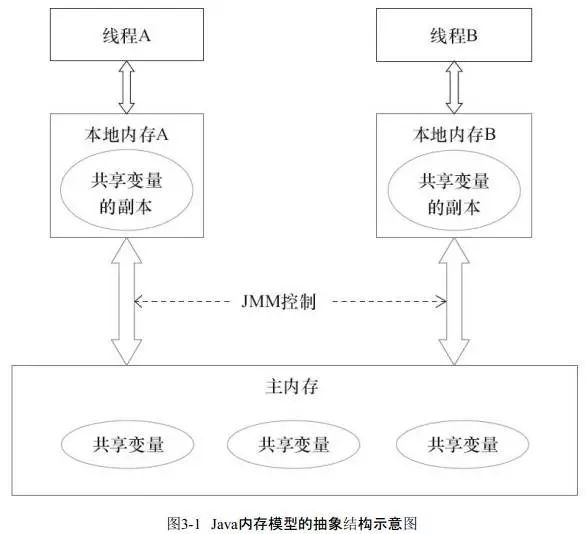

# Java内存模型

[大白话理解内存模型](https://juejin.cn/post/6844903667347226637#heading-14)

---

Java内存模型(Java Memory Model 简称JMM)

由于不同应用系统的内存屏障指令都不相同, 所以JVM将这些内存屏障指令统一封装成一个模型,这就是Java内存模型, **模型定义多线程情况下线程对共享变量的读写行为**. 

>   本身是一种抽象概念, 不是真实存在的

JMM规定:

每个线程中都维护一个工作内存(栈空间), 用于储存线程私有的数据和主内存共享变量的副本. 同时线程中的本地内存对其他线程不可见

所有变量都储存在主内存中, 主内存是共享内存区域, 所有线程都可以访问, 但操作(读/写)只能在工作内存中进行. 

>   首先将共享变量读取到工作内存中, 然后对变量进行操作, 最后再同步回主内存中. 不能直接操作主内存中的数据

---

如果线程需要进行数据交换则需要通过主内存

>   首先线程A把更新过的值属性到主内存中, 然后线程B到主内存中读取更新后的值

>   在命令式编程里线程之间的通讯有2种(java 是共享内存)
>
>   *   共享内存的并发模型
>
>       通过写 - 读内存中的公共状态进行**隐式**通讯.
>
>   *   传递消息的并发模型
>
>       线程之间必须通过明确的发送消息来进行**显式**通讯

