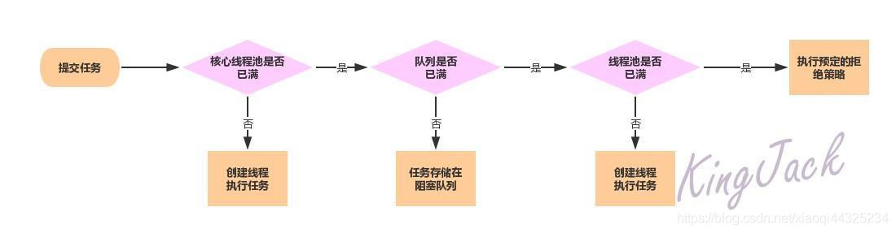

# ThreadPoolExecutor

[线程池：ThreadPoolExecutor 源码解析](https://blog.csdn.net/xiaoqi44325234/article/details/106396871)

[Java线程池实现原理及其在美团业务中的实践](https://tech.meituan.com/2020/04/02/java-pooling-pratice-in-meituan.html)

​		

## 从构造方法看起

```java
ThreadPoolExecutor(int corePoolSize, 				 	// 核心线程数
                   int maximumPoolSize, 				// 最大线程数
                   long keepAliveTime,					// 空余线程最长存活时间
                   TimeUnit unit,					 	// keepAliveTime时间单位
                   BlockingQueue<Runnable> workQueue, 	// 阻塞队列用于保存提交的任务
                   ThreadFactory threadFactory,		 	// 线程工厂
                   RejectedExecutionHandler handler) {	// 拒绝策略
	// ......
    this.corePoolSize = corePoolSize; 		// 关键属性
    this.maximumPoolSize = maximumPoolSize; // 关键属性
    this.workQueue = workQueue;
    this.keepAliveTime = unit.toNanos(keepAliveTime);
    this.threadFactory = threadFactory;
    this.handler = handler;
}
```

>   threadFactory的作用: 构造一个新的Thread. 实现也可以初始化优先级, 名称, 守护程序状态, ThreadGroup等

常用阻塞队列


内置拒绝策略


## 线程池大体流程图



## 关键属性

```java
// 核心线程数
private volatile int corePoolSize;
// 最大线程数(逻辑设定, 代码限制最大是CAPACITY(5亿多))
private volatile int maximumPoolSize;
// 保存线程池中正在执行的线程
private final HashSet<Worker> workers = new HashSet<Worker>();
```

关键标志

```java
// 线程池状态. 高3位保存运行状态,低29位保存运行线程数量(最大可以保存5亿多)
private final AtomicInteger ctl = new AtomicInteger(ctlOf(RUNNING, 0));
// 表示低29位储存线程数
private static final int COUNT_BITS = Integer.SIZE - 3;
// 用于计算线程数量 000 111111111 1111111111 1111111111
private static final int CAPACITY   = (1 << COUNT_BITS) - 1;

/* 高2位储存线程池状态, 低29位储存线程数 大于0就是非运行状态 */
// 101 000000000 0000000000 0000000000 | 运行中 接受新任务并且处理阻塞队列里的任务
private static final int RUNNING    = -1 << COUNT_BITS;
// 000 000000000 0000000000 0000000000 | 关闭中 拒绝新任务但是处理阻塞队列里的任务
private static final int SHUTDOWN   =  0 << COUNT_BITS;
// 001 000000000 0000000000 0000000000 | 停止   拒绝新任务,抛弃队列里的任务,中断正在执行的任务
private static final int STOP       =  1 << COUNT_BITS;
// 010 000000000 0000000000 0000000000 | 执行完 所有任务执行完成,将要调用terminated()
private static final int TIDYING    =  2 << COUNT_BITS;
// 011 000000000 0000000000 0000000000 | 已终止 terminated()调用完后的状态
private static final int TERMINATED =  3 << COUNT_BITS;

// 获取运行状态(高3位)
private static int runStateOf(int c)     { return c & ~CAPACITY; }
// 获取工作线程的数量(低29位)
private static int workerCountOf(int c)  { return c & CAPACITY; }
private static int ctlOf(int rs, int wc) { return rs | wc; }
```


## 核心流程解析

### execute(Runnable command)

将任务交给线程池, 可能触发

1.  直接执行
2.  加入阻塞队列等待执行
3.  触发拒绝

>   优先级: 创建核心线程 > 添加到阻塞队列 > 创建最大线程 (阻塞队列满了才创建最大线程)

```java
public void execute(Runnable command) {
    if (command == null)
        throw new NullPointerException();
    
    // 获取ctl
    int c = ctl.get();
    if (workerCountOf(c) < corePoolSize) { // 当前工作线程数 < 核心线程数 
        if (addWorker(command, true)) // 新建一个线程执行
            return;
        // 创建失败则刷新ctl值继续执行
        c = ctl.get(); 
    }
    
    // 如果线程池处于RUNNING状态 则尝试将任务插入阻塞队列(成功:true)
    if (isRunning(c) && workQueue.offer(command)) {
        int recheck = ctl.get();
        
        // 加入队列后判断: 如果线程池不处于RUNNING 则将任务移出队列
        if (!isRunning(recheck) && remove(command)) 
            reject(command); // 成功移出任务后拒绝任务    
        
        else if (workerCountOf(recheck) == 0) // 检查工作线程数是否为0
            addWorker(null, false);  // 如果线程池中没有线程则创建一个线程
        	// addWorker()参数为null表示只创建新线程用于执行队列中的任务
    }
    
    else if (!addWorker(command, false)) // 加入阻塞队列失败则尝试创建线程执行
        reject(command);
}
```


###addWorker(Runnable firstTask, boolean core)

创建新线程执行任务.

*   `firstTask`不为null时, 优先执行`firstTask`, 
*   `firstTask`为null时, 表示**只新建线程**, 任务从阻塞队列中获取
*   `core`为true时, 如果线程池中正在运行的线程数 >= `corePoolSize` 就不创建线程
*   `core`为false时, 如果线程池中正在运行的线程数 >= `maximumPoolSize` 就不创建线程

```java
/* 创建新线程执行任务 */
// core=true则用corePoolSize计数. =false则用maximumPoolSize计数
private boolean addWorker(Runnable firstTask, boolean core) {
    retry:
    for (;;) {
        int c = ctl.get();
        int rs = runStateOf(c); // 运行状态

        // SHUTDOWN 关闭中 拒绝新任务但是处理阻塞队列里的任务
        /* 以下情况addWorker()失败
        	1.线程池状态 > SHUTDOWN (拒绝所有任务)
        	2.线程池状态 = SHUTDOWN && firstTask != null (firstTask是新任务)
        	3.线程池状态 = SHUTDOWN && 队列为空(队列为空就不需要接受新任务了)*/
        // firstTask==null表示只创建新线程用于执行队列中的任务
        if (rs >= SHUTDOWN &&
            ! (rs == SHUTDOWN && firstTask == null && ! workQueue.isEmpty()))
            return false;

        for (;;) {
            int wc = workerCountOf(c); // 线程数
           	// 如果线程数超过了限制addWorker()失败
            if (wc >= CAPACITY ||
                wc >= (core ? corePoolSize : maximumPoolSize))
                return false;
            
            // 以CAS方式使线程数+1 成功则跳出循环
            if (compareAndIncrementWorkerCount(c))
                break retry;
            
            // CAS失败则重新加载ctl. 运行状态改变则跳回第5行,没改变则跳到18行
            c = ctl.get();
            if (runStateOf(c) != rs)
                continue retry;
        }
    }

    boolean workerStarted = false;
    boolean workerAdded = false;
    Worker w = null;
    try {
        // 将firstTask封装成Worker
        w = new Worker(firstTask);
        final Thread t = w.thread;
        
        if (t != null) {
            final ReentrantLock mainLock = this.mainLock;
            mainLock.lock();
            try {
                int rs = runStateOf(ctl.get()); // 获取运行状态

                /* 线程池状态正常时执行下一步
                	1.运行状态 < SHUTDOWN (RUNNING)
                	2.运行状态 = SHUTDOWN 并且firstTask == null*/
                if (rs < SHUTDOWN ||
                    (rs == SHUTDOWN && firstTask == null)) {
                    
                    // 线程没有启动就存活 抛出异常
                    if (t.isAlive())
                        throw new IllegalThreadStateException();
                    
                    // 将worker添加到workers当中
                    workers.add(w);
                    int s = workers.size();
                    if (s > largestPoolSize)
                        largestPoolSize = s; // 更新历史更新最大线程数
                    
                    // 将workerAdd标志设置为成功
                    workerAdded = true;
                }
            } finally {
                mainLock.unlock();
            }
            
            // workerAdd标志成功则启动线程 并将workerStart标志设置为成功
            if (workerAdded) {
                t.start(); // 关键!!!!
                workerStarted = true;
            }
        }
    } finally {
        // 线程启动失败则走失败流程
        if (! workerStarted)
            addWorkerFailed(w);
    }
    // 返回workerStart标记
    return workerStarted;
}
```


​		

## Worker内部类

从上面可以看到线程池在`addWorker()`就已经完成了一半的逻辑(创建线程), 剩下的逻辑在Worker类中实现(具体执行)

​		

```java
private final class Worker extends AbstractQueuedSynchronizer 
    					   implements Runnable
```

Worker继承AQS类实现Runnable接口, 所以本质上是一个拥有互斥特性的线程

互斥特性主要体现在: 

**worker一旦获取了锁表示正在执行任务, 则不应该中断线程. 反之表示可以中断**

​		

### Worker构造方法

```java
Worker(Runnable firstTask) {
    // 设定初始为-1, runWorker(this)调用w.unlock()前其余都不能获取到锁
    // runWorker(this)后才允许中断
    setState(-1);
    this.firstTask = firstTask;
    this.thread = getThreadFactory().newThread(this);
}
```


### runWorker(Worker w)

执行任务, 执行完成了会从阻塞队列中获取

```java
final void runWorker(Worker w) {
    Thread wt = Thread.currentThread();
    Runnable task = w.firstTask;
    w.firstTask = null; // 
    w.unlock(); // 对应构造方法setState(-1); 
    boolean completedAbruptly = true; // 异常标识
    try {
        // 初始任务不为null 或者 从阻塞队列中成功获取任务 则继续执行
        while (task != null || (task = getTask()) != null) {
            // task != null标识有任务需要执行, 抢占锁(将worker状态改为执行中)
            w.lock();
            
            /* 线程池状态>=STOP(拒绝所有任务)则应该中断 
                Thread.interrupted() => 会清除中断状态
                wt.isInterrupted()   => 不会中断状态 */
            if ( (runStateAtLeast(ctl.get(), STOP) ||
                 	(Thread.interrupted() && runStateAtLeast(ctl.get(), STOP)))
                && !wt.isInterrupted() )
                wt.interrupt();
            
            try {
                beforeExecute(wt, task); // 执行任务前的处理由子类实现
                Throwable thrown = null;
                try {
                    task.run(); // 执行逻辑
                } catch (RuntimeException x) {
                    thrown = x; throw x;
                } catch (Error x) {
                    thrown = x; throw x;
                } catch (Throwable x) {
                    thrown = x; throw new Error(x);
                } finally {
                    afterExecute(task, thrown); // 执行任务后的处理由子类实现
                }
            } finally {
                task = null;
                w.completedTasks++; // 线程任务计数器自增
                w.unlock(); 		// 解锁
            }
        }
        completedAbruptly = false; // 异常标识为false
    } finally {
        processWorkerExit(w, completedAbruptly);
    }
}
```


### getTask()

从阻塞队列中获取任务

```java
private Runnable getTask() {
    boolean timedOut = false; // Did the last poll() time out?

    for (;;) {
        int c = ctl.get();
        int rs = runStateOf(c);

        // 如果线程池已经关闭 || 阻塞队列已经空了
        if (rs >= SHUTDOWN && (rs >= STOP || workQueue.isEmpty())) {
            decrementWorkerCount(); // 自旋方式将ctl中的线程数量-1
            return null;			// 返回null 线程将退出自旋随后销毁
        }

        int wc = workerCountOf(c);

        // 如果allowCoreThreadTimeOut(核心线程允许超时) || 现有线程 > 核心线程
        boolean timed = allowCoreThreadTimeOut || wc > corePoolSize;

        /* 出现以下情况(2个一起出现)要尝试销毁线程
        	1. 线程数量 > 最大线程数 || 已经超时
        	2. 存活线程 > 1	|| 队列为空 (如果队列不为空要确保有线程消费任务)  */
        if ((wc > maximumPoolSize || (timed && timedOut))
            && (wc > 1 || workQueue.isEmpty())) {
            if (compareAndDecrementWorkerCount(c)) // CAS减去线程数
                return null; 
            continue; // 如果CAS失败表示有线程正在退出 在判断一次
        }

        try {
            Runnable r = timed ?
                workQueue.poll(keepAliveTime, TimeUnit.NANOSECONDS) :
                workQueue.take();
            if (r != null)
                return r;
            timedOut = true;
        } catch (InterruptedException retry) {
            timedOut = false;
        }
    }
}
```


## 其他方法解析

###tryTerminate()

尝试关闭线程

```java
/* 当线程池出现异常状态时尝试关闭线程池 */
final void tryTerminate() {
    for (;;) {
        // 获取ctl
        int c = ctl.get();
        
        /* 线程池处于以下状态时不能被关闭
        	1.运行中
        	2.执行完(TIDYING)或已终止(TERMINATED)
        	3.线程状态为SHUTDOWN并且阻塞队列不为空*/
        if (isRunning(c) ||
            runStateAtLeast(c, TIDYING) ||
            (runStateOf(c) == SHUTDOWN && ! workQueue.isEmpty()))
            return;
        
        // 如果工作线程数 > 0. 则给一个worker发送中断信号
        if (workerCountOf(c) != 0) { 
            interruptIdleWorkers(ONLY_ONE);
            return;
        }

        final ReentrantLock mainLock = this.mainLock;
        mainLock.lock();
        try {
            // 以CAS方式设置ctl为TIDYING状态. 失败则自旋
            if (ctl.compareAndSet(c, ctlOf(TIDYING, 0))) {
                try {
                    terminated(); // 留给子类实现
                } finally {
                    ctl.set(ctlOf(TERMINATED, 0)); // 直接设置ctl为TERMINATED
                    termination.signalAll(); // 唤醒所有等待线程
                }
                return;
            }
        } finally {
            mainLock.unlock();
        }
        // else retry on failed CAS
    }
}
```

