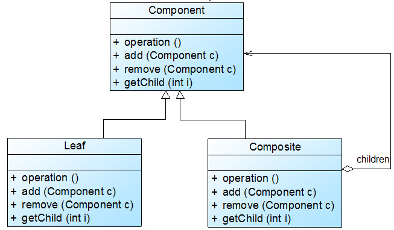
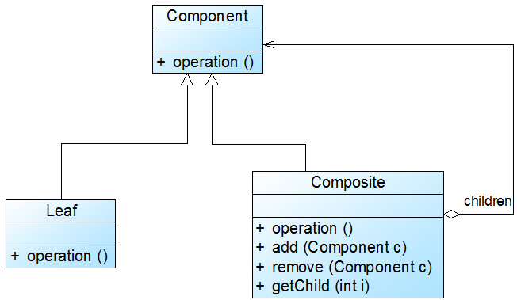

# 组合模式

>   组合模式: 组合多个对象形成树形结构, 对该树的单个对象(叶子)和组合对象(容器)操作具有一致性


## 参考资料

[组合模式总结](https://blog.csdn.net/LoveLion/article/details/7956962)     

[透明组合_安全组合](https://blog.csdn.net/LoveLion/article/details/7956937)     

[组合模式概述](https://blog.csdn.net/LoveLion/article/details/7956908)     

[组合模式概述&示例](http://www.jasongj.com/design_pattern/composite/)


## 概念

* **抽象构件**

    可以是抽象类或者抽象接口, 包含了 **叶子构件** 和 **容器构件** 所共有的方法

* **叶子构件**

    组合模式中的最小单位

* **容器构件**

    容器构件可以包含 **叶子构件** 和 **容器构件** , 提供了一个集合用于储存子节点. 在其业务方法(抽象构件中定义的抽象方法)中可以递归调用子节点的业务方法


## 一般用法

1.  分析业务逻辑, 分化出主要业务方法
2.  根据共有的业务方法定义 抽象类/接口(**抽象构件**)
3.  继承/实现 **抽象构件** , 创建 **叶子构件** . 定义其业务方法. 业务方法只需考虑本身节点的实现
4.  继承/实现 **抽象构件** , 创建 **容器构件** . 并在内部添加集合属性, 用于保存 **叶子构件** . 业务方法实现需要递归调用保存在集合属性的 **叶子构件** 的业务方法

```java
// 安全组合模式
public class Composite {
    static abstract class IObject {
        String name;

        public IObject(String name) {
            this.name = name;
        }
        public abstract void show();
    }

    static class File extends IObject {
        public File(String name) {
            super(name);
        }
        @Override
        public void show() {
            System.out.println(name);
        }

    }

    static class Folder extends IObject {
        List<IObject> childList = new ArrayList<>();
        Integer level;

        public Folder(String name, Integer level) {
            super(name);
            this.level = level;
        }

        @Override
        public void show() {
            System.out.println(name + "  层级:" + level);
            childList.forEach(IObject::show);
        }

        public void addIObject(IObject iObject) {
            childList.add(iObject);
        }

        public void list() {
            childList.forEach(c -> System.out.println(c.name));
        }
    }

    // 所谓安全组合模式即是符合最少知道原则的组合模式
    // 如果把Folder类的addIObject(), list()放到IObject中.FIle实例也可以调用就是透明组合模式
    public static void main(String[] args) {
        File qqFile = new File("qq.exe");
        File streamFile = new File("stream.exe");

        Folder rootFolder = new Folder("root", 0);
        Folder gameFolder = new Folder("gameFolder", 1);

        gameFolder.addIObject(streamFile);
        rootFolder.addIObject(qqFile);
        rootFolder.addIObject(gameFolder);

        System.out.println("show=============");
        rootFolder.show();
        System.out.println("list=============");
        gameFolder.list();
    }
}
```


## 应用实例

1.  spring缓存管理器 (CompositeCacheManager)
2.  springMVC属性处理 (HandlerMethodArgumentResolverComposite)


## 优缺点

*   优点

    简化了客户端调用的代码

    树形结构可以清楚的定义分层次的复杂对象, 并且对树形结构的控制很简单

    拓展性好, 增加新容器和叶子都无需修改现有代码, 很方便

    更加面向对象, 面向现实了~

*   缺点

    比较难对容器的构件类型进行限制(不能依赖系统的类型校验, 只能运行时编码校验)


## 透明组合模式

1.  将 **叶子构件** 和 **容器构件** 的 *所有方法* 都封装在 **抽象构件**中
2.  在 **抽象构件** 中将所有方法都默认实现为错误提示`System.out.println("不支持该方法！");`
3.  **叶子构件** 和 **容器构件** 分别重写所需的方法

透明模式不透明的使用方法: 在创建构件时不使用多态, 直接使用构件本身, 这样只要不主动调用父类的方法就不会出现报错提示

>   [!note] 
>
>   透明组合模式是组合模式的标准形式: **客户端可以相同地对待所有的对象**




## 安全组合模式

1.  只将 **叶子构件** 和 **容器构件** 的 *业务方法* 封装在 **抽象构件**中
2.  **叶子构件** 和 **容器构件** 分别重写业务方法, 并添加特有方法

>   安全组合模式的缺点是不够透明, 必须有区别地对待叶子构件和容器构件
>
>   但, 还挺好用的~





## 总结

组合模式的关键是定义了一个抽象构件类，它既可以代表叶子，又可以代表容器

而客户端针对该抽象构件类进行编程，无须知道它到底表示的是叶子还是容器，可以对其进行 **统一处理**

同时容器对象与抽象构件类之间还建立一个聚合关联关系，在容器对象中既可以包含叶子，也可以包含容器，以此实现递归组合，形成一个树形结构。

