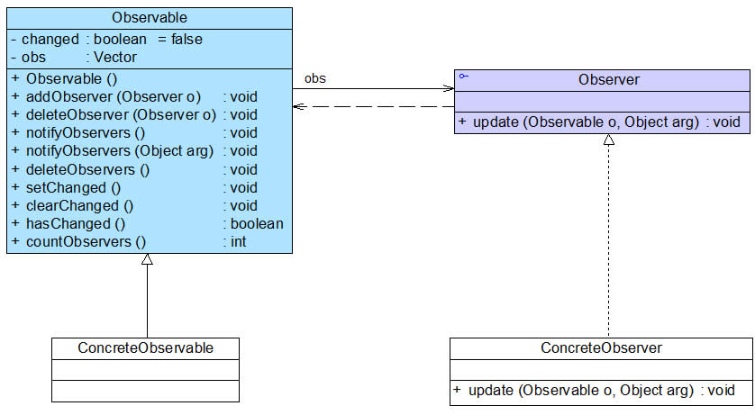

# 观察者模式

>   观察者模式: 定义一种一对多关系, 当一个对象改变时, 其依赖的对象会接受通知, 并改变

使用最广泛的模式


## 参考资料

[观察者模式概念](https://blog.csdn.net/LoveLion/article/details/7720382)

[观察者模式案例](https://blog.csdn.net/LoveLion/article/details/7720490)

[观察者模式与java事件处理](https://blog.csdn.net/LoveLion/article/details/7720522)

[JDK对观察者模式的支持](https://blog.csdn.net/LoveLion/article/details/7720507)

[观察者模式总结](https://blog.csdn.net/LoveLion/article/details/7720537)


## 概念

*   **目标**

    被观察对象. 可以是接口, 抽象类, 具体类

    定义了一个观察者集合

    提供了一系列方法来增加删除观察者

    同时定义了通知方法notify()

*   **具体目标**

    目标类的子类, 可省略

    通常包含经常变化的数据

    当他状态发生变化时, 向各个观察者发出通知

    同时还实现了目标类的抽象方法(如果有)

*   **观察者**

    对观察目标的改变作出反应(体现为一个被目标调用的抽象方法update())

    一般为接口

*   **具体观察者**

    实现了抽象观察者的方法, 可以对目标的改变作出反映

    维护一个目标的引用(可以不维护, 作用是可以把自身状态传给目标, 可以没有)


## 一般用法

1.  创建 **抽象观察者类** (有一个接受信息的方法, 一般为接口)

    ```java
    public interface Observer {
        void update(String msg);
    }
    ```

2.  创建 **具体观察者类** (实现抽象观察者的方法)

    ```java
    public class ConcreteObserver implements Observer {
        private String name;
        public ConcreteObserver(String name) {
            this.name = name;
        }
        @Override
        public void update(String msg) {
            System.out.println(this.name + " | " + msg);
        }
    }
    ```

3.  创建 **抽象目标** 提供保存观察者的方法和修改该集合的方法, 同时定义了notify()用于将信息传递到观察者

    ```java
    public abstract class BaseSubject {
        protected List<Observer> list = new ArrayList<>();
    
        public boolean add(Observer observer) {
            return list.add(observer);
        }
    
        public boolean del(Observer observer) {
            return list.remove(observer);
        }
    
        public abstract void notifyObserver(String msg);
    }
    ```

4.  创建 **具体目标** 主要是实现了notify()

    ```java
    public class Subject extends BaseSubject {
        @Override
        public void notifyObserver(String msg) {
            for (Observer observer : list) {
                observer.update(msg);
            }
        }
    }
    ```

5.  使用

    ```java
    public class App {
        public static void main(String[] args) {
            BaseSubject subject = new Subject();
    
            subject.add(new ConcreteObserver("陈"));
            subject.add(new ConcreteObserver("赵"));
            subject.add(new ConcreteObserver("李"));
    
            subject.notifyObserver("没什么给你们发条消息");
        }
    }
    ```

    输出

    >   陈 | 没什么给你们发条消息
    >   赵 | 没什么给你们发条消息
    >   李 | 没什么给你们发条消息


## 应用实例


## 优缺点

*   优点

    支持广播通信, 简化了一对多系统的设计难度

    增加观察者, 目标都符合开闭原则

    目标和观察者耦合度低(目标类只维护了一个抽象观察者集合)

*   缺点

  如果有很多的观察者广播将会花费很多时间
  
  >   或许可以针对优化一下, 在观察者中也设置一个change, 改变这个change说明有新广播, 运用内存技术,将广播内容共享, 不是主动推送. 应该会比直接推送msg快
  
  如果目标和观察者存在循环依赖, 可能导致系统奔溃
  
  观察者模式没有相应的机制让观察者知道所观察的目标对象是怎么发生变化的，而仅仅只是知道观察目标发生了变化(这句话看不懂, 目标对于观察者透明不是一种好处吗? 加上如果要知道的话还是有办法的吧)


## 总结

观察者模式主要是为 对象之间的联动提供一套完整的解决方案.

凡是涉及到一对一或者一对多的对象交互场景都可以使用观察者模式

详情请看参考 观察者模式与java事件处理


## 关于观察者与目标

一般是目标对象主动推送消息到各个观察者

但并不是绝对, 如参考资料中的案例

案例中观察者即是目标也是观察者, 案例中的`目标`只是用于群发消息

上面概念中的

>   维护一个目标的引用(可以不维护, 作用是可以把自身状态传给目标, 可以没有)

主要也算让观察者拥有对各个观察者发送消息的权限


## 关于JDK对观察者模式的支持

观察者模式在Java语言中的地位非常重要。在JDK的java.util包中，提供了Observable类以及Observer接口，它们构成了JDK对观察者模式的支持



### Observer接口

在java.util.Observer接口中只声明一个方法，它充当 **抽象观察者**

```java
    void update(Observable o, Object arg);
```

当观察目标的状态发生变化时，该方法将会被调用


### Observable类

java.util.Observable类充当观察 **抽象目标类**, 在内定义了

```java
// 用于判断目标对象改变了, 只有这个为true, 才能发送消息到观察者
private boolean changed = false;
// 用于保存观察者, 注意默认不可重复
private Vector<Observer> obs;
```

| **方法名**                                     | **方法描述**                                                 |
| ---------------------------------------------- | ------------------------------------------------------------ |
| Observable()                                   | 构造方法，实例化Vector向量。                                 |
| addObserver(Observer  o)                       | 用于注册新的观察者对象到向量中。                             |
| deleteObserver  (Observer o)                   | 用于删除向量中的某一个观察者对象。                           |
| notifyObservers()和notifyObservers(Object arg) | 通知方法，用于在方法内部循环调用向量中每一个观察者的update()方法。 |
| deleteObservers()                              | 用于清空向量，即删除向量中所有观察者对象。                   |
| setChanged()                                   | 该方法被调用后会设置一个boolean类型的内部标记变量changed的值为true，表示观察目标对象的状态发生了变化。 |
| clearChanged()                                 | 用于将changed变量的值设为false，表示对象状态不再发生改变或者已经通知了所有的观察者对象，调用了它们的update()方法。 |
| hasChanged()                                   | 用于测试对象状态是否改变。                                   |
| countObservers()                               | 用于返回向量中观察者的数量。                                 |

>   [!notice]
>
>   建议直接用JDK的

