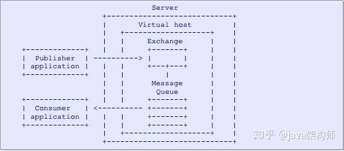
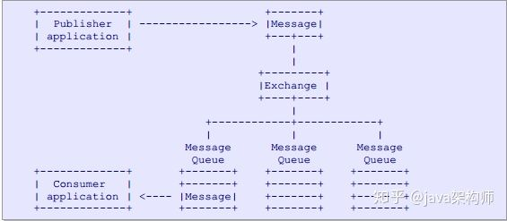

# AMQP协议

[RabbitMQ AMQP (高级消息队列协议)](https://zhuanlan.zhihu.com/p/47868902)

AMQP(高级消息队列协议) 是应用层协议的一个开放标准, 为面向消息的中间件设计. 基于此协议的客户端与消息中间件可传递消息, 不受开发语言限制

## AMQP模型

>   生产者(publisher) 和消费者(consumer) 需要与server 保持连接
>
>   生产者与消费者绑定时需要指定虚拟主机(virtual host) 
>
>   交换机(exchange) 和 消息队列(Message Queue) 被包含在Virtual host的作用域范围之内

