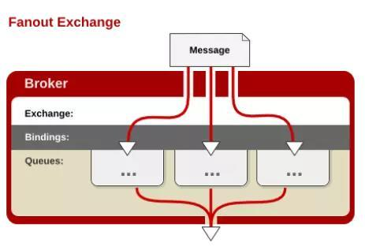
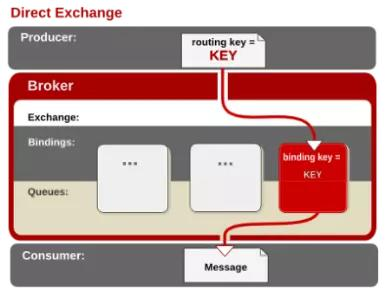
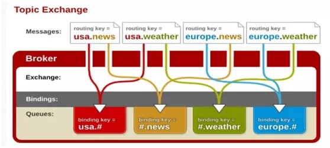

# Exchange

[全网最全RabbitMQ总结](https://www.cnblogs.com/erlie/articles/12222737.html)

## Fanout Exchange

广播交换机, 直接把消息发送到交换机绑定的所有队列上. **不处理路由键**, 速度最快

## Direct Exchage

直连交换机, 把消息发送到BindingKey 和RoutingKey**完全匹配**的队列中

## Topic Exchange

主题交换机, 把消息发送到BindingKey 和RoutingKey相匹配的队列中

和Direct Exchange的全匹配不同的是 Topic Exchange可以使用通配符进行模糊匹配

>   '#' : 模糊匹配多个单词(包含0个, 1个)
>
>   '*' : 模糊匹配一个单词
>
>   绑定的BindingKey 用通配符(API里BindingKey 和RoutingKey是一个名称)

## headers Exchange

头交换机, 依靠消息头来路由, 性能很差

