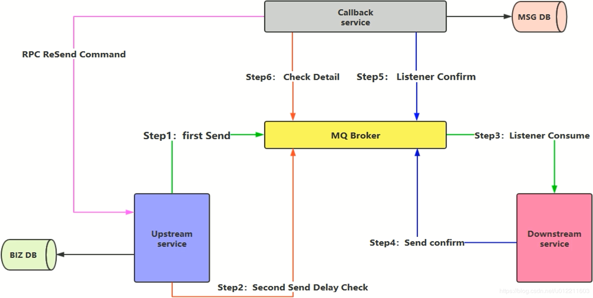

# 确保消息投递

[RabbitMq 高级特性](https://blog.csdn.net/yjw123456/article/details/84900667)

>   感觉被网上的教程坑了, 确保消息投递是
>
>   **在幂等的前提下尽量少的发送消息来尽可能的确保接收端到信息**
>
>   网上的都是先说确保投递再说幂等= = 害我走进思维误区想怎么在只在确保接收端只收到1条消息的前提下做消息投递.....

## 何确保消息投递

1.  保障消息的成功发出

2.  保障MQ成功接收消息

3.  发送端要收到MQ的确认应答

    >   如果没收到应答应该重新发送, 并且让接收端弃用这条消息(比如网络闪断的情况(消息是发过去了, 只是没有收到应答))

4.  补偿机制

## 消息入库 对消息进行标记

## 延迟投递 做二次确认

想通之后就简单了, 流程图都不想再画一次

延迟投递就是把补偿服务抽取出来并且和回调服务合并

上游服务将在第一次发送消息后的n分钟再发送一条消息到补偿服务, 检查补偿服务/回调服务是否有消息的消费信息, 如果没有触发补偿服务重新传递消息

两种方法各有好处

第一种比较简单, 但是多入了一次数据库

第二种比较复杂(图上面的感觉也有问题上游的确认消息送不到回调服务怎么办)并且多了3次MQ的消息通讯, 但少了一次入库

>   图上面的感觉也有问题上游的确认消息送不到回调服务怎么办
>
>   感觉补偿服务应该还要定时扫描数据库, 比对MSG DB 和 BIZ DB, 数据少了的就说明没有消费到应该走补偿流程, 可是这样又太重了
>
>   >   按时间分表的话可以对比1-2 天的时间
>   >
>   >   按地区分表的话执行n(地区个数) 的sql? 

