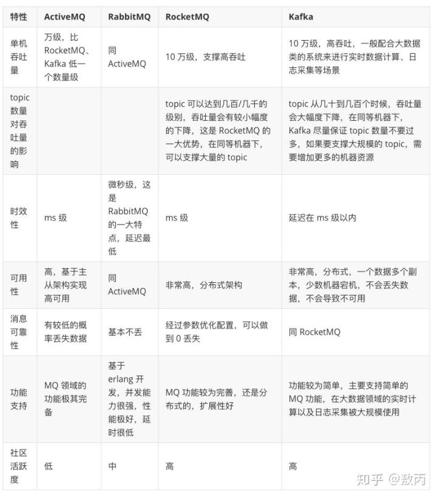

# 什么是MQ

[MQ消息中间件最全面分析](https://mp.weixin.qq.com/s/lqFGnIUtqTFZ_GHp46z48Q) 

消息队列(Message Queue) 一种用于上下游传递消息的 **跨进程** 通讯机制

## 优势

*   解耦
*   异步
*   削峰/限流

## 劣势

*   增加系统复杂性
*   引入了 消息队列的高可用，重复消费、消息丢失、消息顺序、分布式事务等问题

## MQ选用

