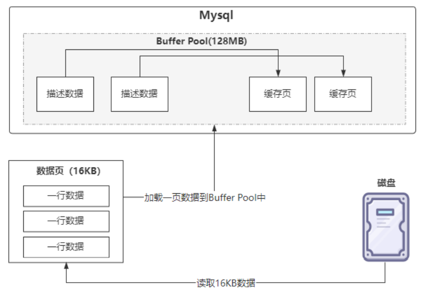
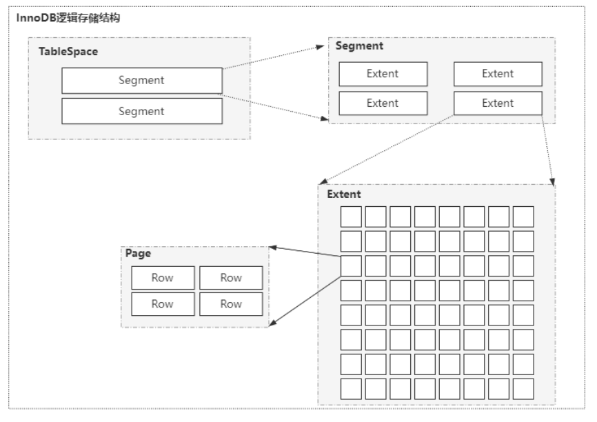
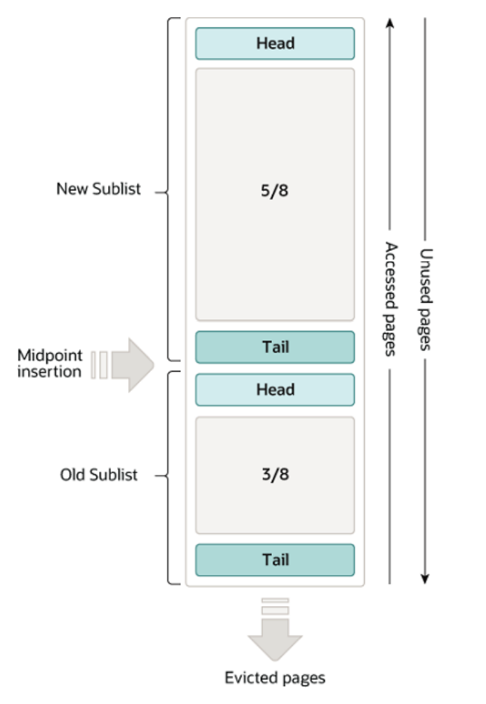
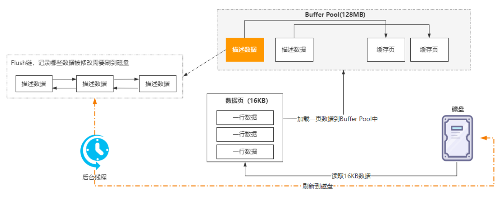
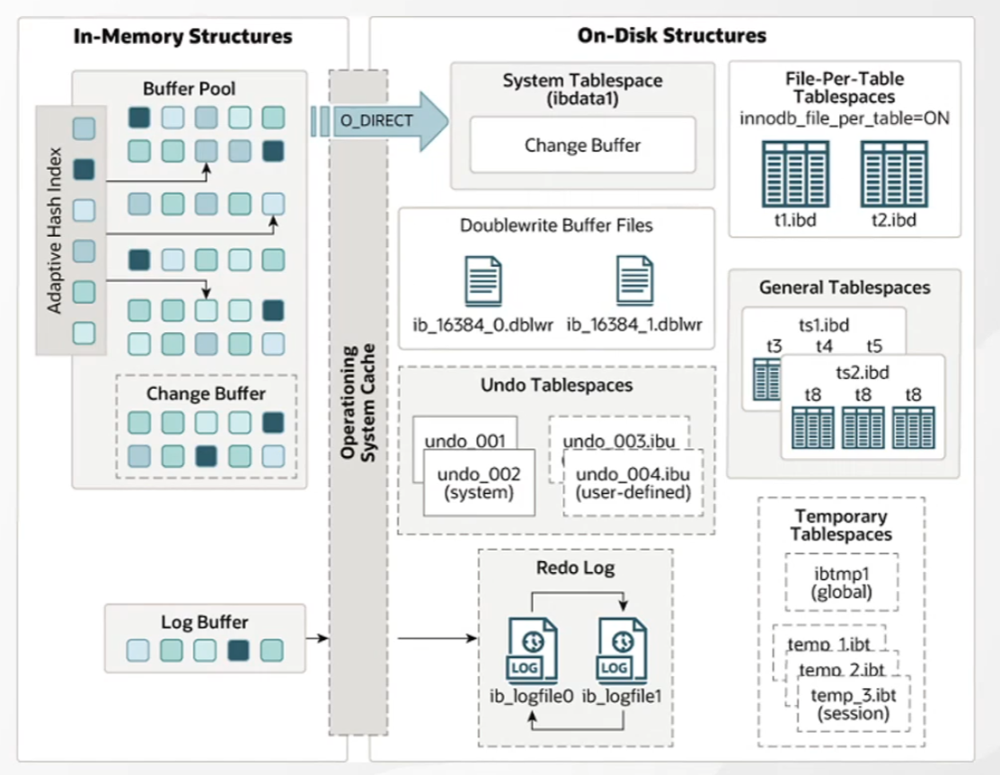

# BufferPool

在Mysql中, 不管使用哪种储存引擎最终都会将数据持久化到硬盘上.

当我们需要对数据进行**操作**时, 首先要先把数据加载到内存中. 在内存中计算完成后再写回到磁盘. 这个效率是比较低的

于是引入了BufferPool(缓冲池)的概念. **BufferPool缓存热的数据页和索引页, 减少磁盘读**

对数据的修改就变成了

1. 尝试能否从BufferPool中获取对应数据, 不能就从磁盘获取后写入到BufferPool
2. 修改数据时先将数据写入到BufferPool. 再由后台线程写入文件

## PageCache

InnoDB设定了一个存储引擎从磁盘读取数据到内存的最小单位叫页(操作系统中也有页的概念, 一般是4k). 默认大小为16k

> 可以通过参数`innodb_page_size`修改

每个PageCache会对应一个**描述数据**, 这个描述数据本身也是一块数据, 它包含: 

* 数据页所属的表空间
* 数据页编号
* 数据页在BufferPool中的地址等信息

​		

在Page之上还有一个Extent(区), Segment(段), Tablespace(表空间)的概念

64个Page=1个Extent

> BufferPool只会存Page. 

## 预加载机制

[官网配置 InnoDB 缓冲池预读](https://dev.mysql.com/doc/refman/8.0/en/innodb-performance-read_ahead.html)

根据局部性原理, 当磁盘上的某块数据被读取时很有可能它附近位置的数据马上也会被用到

InnoDB使用两种预读算法来提高I/O性能

* **线性预读**(linear read ahead)

  将下一个区(Extent)的数据读取到BufferPool中, 默认至少读取了一个区的56个之后会触发

* **随机预读**(randomread-ahead)

  将当前区(Extent)剩余的数据读取到BufferPool中. 默认关闭. 如果开启的话读取一个区的13个页就会触发

## BufferPool管理(LRU)

BufferPool默认128M. 官方建议可以修改为机器内存的50%~70%

> 可以通过`innodb_buffer_pool_size`修改

LRU是指缓存空间耗尽时的淘汰策略

BufferPool分为2部分

* **New Sublist**(用于保存热数据)
* **Old Sublist**(用于保存冷数据)

> 之所以分为2部分是为了避免一次性加载很多数据, 把真正的热点数据挤出BufferPool
>
> Old Sublist默认占BufferPool37%, 可以通过`innodb_old_blocks_pct`修改

所有新数据页加入BufferPool时都会先加载在Old Sublist的Head位置. 

如果**被访问**就会移动到New Sublist

数据淘汰时会直接从Old Sublist中进行淘汰(Tail部分)

除此之外只要Old Sublist中的**数据存在1秒以上**, 也可以移动到New Sublist

> 为什么是1秒? 
>
> 通过预读机制和全表扫描加载进来的数据页通常是1秒内就完成. 完成后就会在Old Sublist等待刷盘清空不大有机会放入New Sublist. 可以通过`innodb_old_blocks_time`修改

## BufferPool脏数据刷盘

在以下4种情况之一满足就会将**已修改的缓存数据**同步到磁盘

1. 后台线程定时刷新
2. Buffer Pool内存不足
3. Redo Log写满
4. 数据库正常关闭

因为BufferPool中的数据不一定是修改过的数据, 也有可能是预读到的数据, 将BufferPool的数据全部刷一次盘很明显不合理

因此引入了一个Flush链表.

Flush链表本质是通过修改缓存页, 使其组成一个双向链表. 这样同步Flush链表中的数据即可

> 图片错了 flush保存的应该是数据页

## ChangeBuffer

BufferPool中的一部分. 是为了缓解磁盘写的一种手段. 

> 可以通过`innodb_change_buffer_max_size`修改

**非唯一普通索引页**不在BufferPool中时, 对页进行了写操作的情况下

1. 先将变更记录缓存到ChangeBuffer
2. 等未来数据被读取时将ChangeBuffer中的操作merge到原数据页的

> 5.5前只针对插入操作也叫作InsertBuffer, 现在对更新/删除也有效
>
> 可以通过`innodb_change_buffering`修改ChangeBuffer的类型, 默认all(插入/更新/删除)

下情况会触发merge:

- 访问这个数据页
- 后台master线程会定期 merge
- 数据库缓冲池不够用时
- 数据库正常关闭时
- RedoLog写满时

## Doublewrite Buffer Files

粗略写一下, 这不算是BufferPool的内容

Doublewrite Buffer Files主要是为了防止持久化的时候由于系统异常导致的页断裂

因为系统页默认4k, 而mysql的page默认16k, 这就导致了可能持久化时会出现异常. 

因此再持久化到数据文件前会先持久化到Doublewrite Buffer Files. 

出现异常时可以从Doublewrite Buffer Files恢复

> Doublewrite Buffer Files是顺序写, 所以比较快

