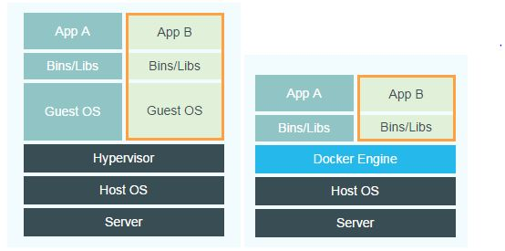

# docker简介

1.  **什么是docker**

    *   基于GO语言的容器引擎
    *   实现轻量级操作系统虚拟化的解决方案

     

2.  **docker优势**

    *   *兼容性* : docker可以在主流平台上运行
    *   *高效的资源利用率*: 相比传统虚拟机技术, 容器除了运行其中的镜像工程外基本不消耗额外系统资源
    *   *高效部署*: docker镜像的轻量级带来的是高效的下载和启动项目. 而且容器是基于镜像的标记应用. 所以对镜像工程的增加也是非常友好
    *   *准化开发环境和运维环境*: 开发人员交付代码时交付镜像,或者运维人员先配置好镜像交付到开发人员中,使测试和开发环境一致

     

3.  **docker和传统虚拟机技术**

    简单的说就是

    vm有一层GuestOS(**是一个完整的系统内核**) 利用GuestOS模拟内核, 利用Hyperivsor实现硬件资源虚拟化. 
    而docker直接使用宿主机内核和硬件

    因此在内存和cpu利用率上docker 更有优势

    [复杂的说](https://blog.51cto.com/11880730/2116096)

    
     

4.  **基本概念**

    通俗的说镜像是个只读的程序内核, 容器是部署在镜像之上用于持久化修改镜像操作的持久层
