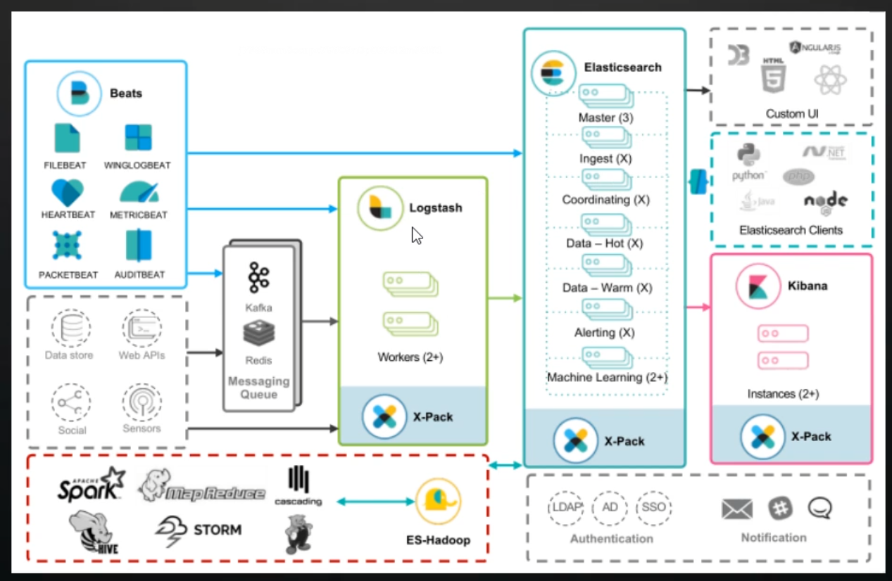
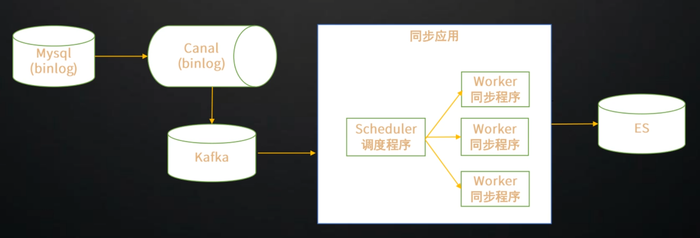
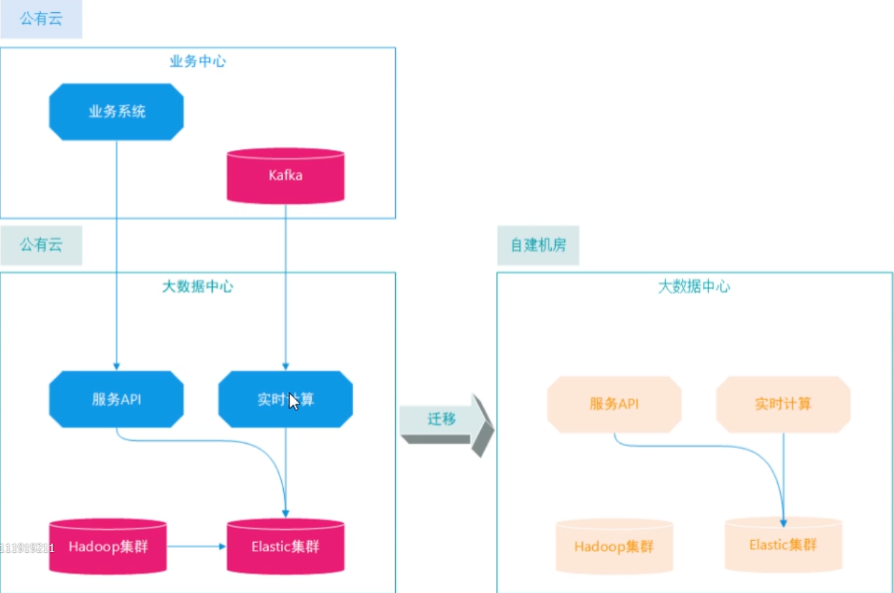

# ElasticStack

## 什么ElasticStack

Elastic生态

### Elasticsearch

Elastic生态核心

有分布式, 高性能, 高可用, 实时搜索, 聚合统计等功能

Elasticsearch是数据库, 不是普通的java程序. 传统数据库需要的硬件资源同样需要. 提升性能最有效的就是升级硬件

Elasticsearch是文档型数据库, 不是关系型数据库, 不具备ACID事务特性. 任何企图直接替代严格事务性场景的应用项目都会失败

### Logstash

数据处理服务程序

ETL灵活处理引擎, 解析转换加工数据, 多数据源输入输出, 横向扩展, 200多插件

### Kibana

数据展示与es集群管理

数据可视化, es管理于监控

### Beats

轻量级数据采集工具

支持多数据源, 多终端

### ES-Hadoop

ES-hadoop连接器

双向链接Hadoop, 数据备份HDFS, 支持Hive/Spark交互(es可以通过ES-hadoop和Hadoop生态进行链接)

## ElastcStack能干什么

### 全文检索

支持多语言分词, 知识库,电商商品, 垂直领域搜索

> 中文搜索非常难, 一般也只是做到基于分词搜索

### 地理应用

地理位置应用搜索

集成Geohash, 支持大规模地理位置搜索, 结合自身的分布式特性可以满足海量数据Geo搜索

### 向量检索

相识图片\语音搜索, 问答系统, 推荐系统

内置支持Dense Vector数据类型, 与多种向量产品集成, 支持多种向量应用场景

### 业务系统查询加速(替换关系型数据库)

关系型数据查询性能瓶颈, 分库分表合并查询, 海量数据查询, 复杂条件组合查询

> 并不是说替换传统DB, 传统DB有传统的优点(事务), ES擅长搜索

### 大数据领域

ES具有强大的数据处理能力. 可以和Hadoop集成为提供Hadoop对外数据的查询能力. 具有简单的大数据处理能力(聚合, 转换, 大规模明细查询)

### 日志平台

统一日志平台, 原生支持多种中间件日志组件, 具有全量索引的特性

### 基础监控

采集基础指标, 基于时序数据储存, 性能一定方面上超过时序数据库

### 安全分析

机器学习算法模型训练, 分析预测潜在网络安全

