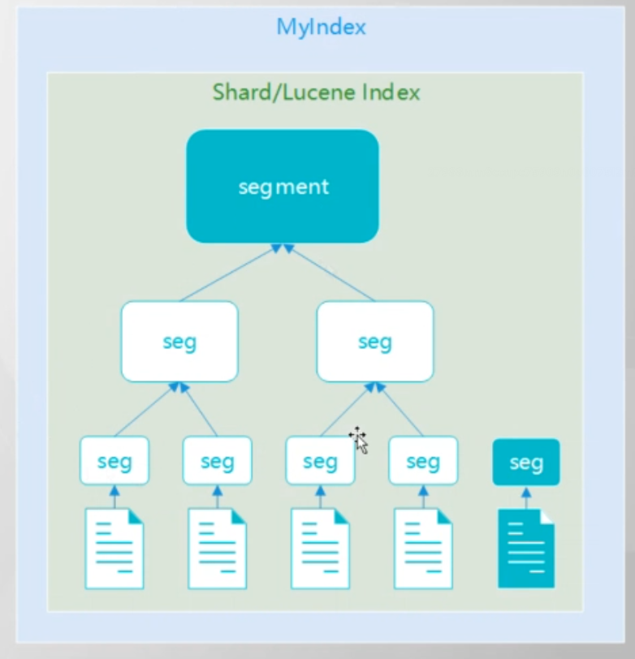

# 数据写入时排序

[官网Index modules » Index Sorting](https://www.elastic.co/guide/en/elasticsearch/reference/8.2/index-modules-index-sorting.html)

在索引创建时可以指定数据的排序. 

```json
PUT common-test-001
{
  "settings": {
    "index": {
      "sort.field":"@timestamp",
      "sort.order": "asc"
    }
  },
  "mappings": {
    "properties": {
      "@timestamp": {
        "type": "date"
      }
    }
  }
}
```


ES底层是分段储存的, 在不指定`index.sort`的情况下是随机挑选`seg`. 在指定了之后就会挑选seg入库. 能**成倍提高入库和查询时间**.

但是不能依靠`index.sort`进行数据的默认排序. 因为es是多分片的多分段的




