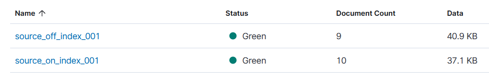
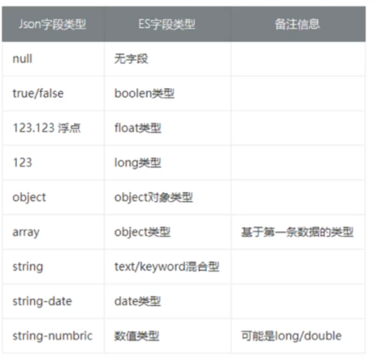

# Mapping

Mapping与传统数据库的表结构相识. 但比传统表结构灵活

主要作用: 规范ES索引结构和行为. 性能优化的重要一环

Mapping不能删除列(可以新增). 只支持3种动态更新, 其余更新都要借助reindex做迁移

1. 字段添加fields
2. object类型添加字段
3. keyword添加`ignore_above`

```shell
PUT /mapping_index_001 
{
    "settings": {
        "number_of_replicas": 1,
        "number_of_shards": 1
    },
    "mappings": {
      "properties": {
        # 后续该字段就会严格按照类型校验
        "company01" : {
          "type": "text"
        },
        "company02" : {
          "type": "text"
        }
      }
    }
}

# 查看mapping
GET /mapping_index_001/_mapping

# 新增
# 也可以新增doc的时候自动新增
PUT /mapping_index_001/_mappings
{
  "properties": {
    "company01": {
      "type": "text"
    },
    "company02": {
      "type": "text"
    },
    "company03": {
      "type": "text"
    }
  }
}
```


## mapping属性

**重要属性**

* **[dynamic](#dynamic)**: (enum)

  是否允许动态新增字段, 默认true(允许)

* **[_source](#_source)**: (boolean)

  用于确定是否保存原始数据, 默认true(保存).

* **[runtime](#runtime)**: (object array)

  运行时类型

* **[dynamic_templates](#dynamic_templates)**: (object array)

  动态模板


**映射相关**

* **[date_detection](#date_detection)**: (boolean)

  日期类型是否自动映射, 默认true(映射)

* **dynamic_date_formats**: (string array)

  配合`date_detection`使用. 表示满足格式的才映射为date类型

  默认值为`["strict_date_optional_time","yyyy/MM/dd HH:mm:ss Z||yyyy/MM/dd Z"]`

* **[numeric_detection](#numeric_detection)**: (boolean)

  数值类型是否自动映射(包括int和float). 默认true(映射)

​		

### dynamic

**dynamic**: (enum)

是否允许**动态**新增字段. 默认`true`. 

此字段加在mapping表示全局. 也可以加载`object`等类型上

`ture`: 默认值. 表示如果新增语句中附带mapping不包含的属性. 则会新增一个

`false`: 表示允许新增. 但不允许被当成搜索条件. 仅仅用作一个数据字段

`runtime`: 允许新增, 但是新增的字段会被映射成runtime类型

`strict`: 不允许新增

> 此属性可以加载Object或者nested里, 不允许子属性动态新增类型

```shell
PUT /dynamic_false_index_001/
{
  "mappings": {
    "dynamic": false
    "properties": {
      "company01": {
        "type": "text"
      }
    }
  }
}
```


### _source

**_source**: (boolean)

用于确定是否保存原始数据. 默认`true`

`false`: es不保存原始数据

> `_source=false`一般用在原始数据储存在另一个地方. es只提供查询功能的场景. 能节省大量内存

​		

以下3种情况`_source`必须为`true`

1. 文档需要使用update或者update_by_query更新(可以用id更新)
2. 会用到reindex
3. 需要文档高亮功能

```shell
# 创建_source关闭的索引
PUT /source_off_index_001/
{
  "mappings": {
    "_source": {
      ## 也可以用includes/excludes选择保存
      "enabled": false
    }, 
    "properties": {
      "company01": {
        "type": "text"
      }
    }
  }
}

# 增加1-9的doc
POST source_off_index_001/_doc/4
{
  "company01": "4"
}
```

查询

```shell
GET /source_off_index_001/_search
{
  "query": {
    "match": {
      "company01": "4"
    }
  }
}
```

结果可以查询出**对应的id**

```json
"hits" : [
      {
        "_index" : "source_off_index_001",
        "_type" : "_doc",
        "_id" : "4",
        "_score" : 1.6739764
      }
    ]
```




### date_detection

日期类型检测 默认ture

```json
PUT common-test-001
{
  "mappings": {
    "date_detection": true
  }
}

// date_detection=true时field1为date类型. =false时为keyword
POST common-test-001/_doc
{
  "field1": "2022-02-02"
}

```


**dynamic_date_formats**

配合`date_detection`使用. 表示满足格式的才映射为date类型

默认值为`["strict_date_optional_time","yyyy/MM/dd HH:mm:ss Z||yyyy/MM/dd Z"]`

> strict_date_optional_time是内置的时间格式有很多

```json
PUT common-test-001
{
  "mappings": {
    "date_detection": true,
    "dynamic_date_formats": ["MM/dd/yyyy"]
  }
}

POST common-test-001/_doc
{
    "field1": "2202/02/02",
    "field2": "02-02-2202",
    // 只有field3才会检测为日期类型
    "field3": "02/02/2202"
}
```


### numeric_detection

数值类型检测 默认true. 最好还是显示指定, 不要依赖es的推测




### runtime

查询运行时字段才会计算实际值.

不占用source, 不占用磁盘. 使用的是painless脚本


```json
PUT source-test-001
{
  "mappings": {
    "properties": {
      "field1": {
        "type": "integer"
      }
    },
    "runtime": {
      "inc_field": {
        "type": "long",
        // 定义一个脚本, 将field1的值*1000
        "script": {
          "source": """
          emit(doc['field1'].value * 1000)
          """
        }
      }
    }
  }
}
```

录入

```json
{
  "field1": 111
}
```

查询

```json
GET source-test-001/_search
{
  "query": {
    "range": {
      // 搜索可以直接用
      "inc_field": {
        "gte": 1000
      }
    }
  },
  // 需要用这个才能展示
  "fields": ["*"],
  // 也可以这样用
  // "runtime_mappings": {
  // "inc_field2": {
  // "type": "long",
  // "script": {
  //    "source": """
  //     emit(doc['field1'].value * 1000)
  //   """
  //  }
    }
  }
}
```

删除

```json
// 8.x
PUT my-index-000001/_mapping
{
 "runtime": {
   "day_of_week": null
 }
}
```


### dynamic_templates

将符合要求的字段类型映射成固定类型.

可以配置多个dynamic_templates, 按顺序匹配.

> `dynamic=true/runtime`才能映射

​		

有3大类5种匹配方式

* 按照检测类型匹配

  match_mapping_type

* 按照通配符匹配

  match/unmatch

* 按照路径匹配

  path_match/path_unmatch

> 在同一个template中是**且**的关系

​		

dynamic_templates有2个内置占位符`{name}(动态映射字段的名称)`和`{dynamic_type}(动态映射的类型)`. 

可以做一些骚操作. 如:

```json
PUT my-index-000001
{
  "mappings": {
    "dynamic_templates": [
      {
        "named_analyzers": {
          "match_mapping_type": "string",
          "match": "*",
          "mapping": {
            "type": "text",
            "analyzer": "{name}"
          }
        }
      },
      {
        "no_doc_values": {
          "match_mapping_type":"*",
          "mapping": {
            "type": "{dynamic_type}",
            "doc_values": false
          }
        }
      }
    ]
  }
}

PUT my-index-000001/_doc/1
{
  "ik_smart": "Some English text", // 将映射字段名称ik_smart指定为分词器
  "count":   5  // 将其余类型的doc_values禁用(也可以指定其他属性)
}

// 最终得出的mapping
{
  "properties" : {
    "count" : {
      "type" : "long",
      "doc_values" : false
    },
    "english" : {
      "type" : "text",
      "analyzer" : "ik_smart"
    }
  }
}
```


#### 通过类型转换

```json
PUT common-test-001
{
  "mappings": {
    "dynamic_templates": [
      {
        "long_2_keyword": { // 规则名称. 唯一
          "match_mapping_type": "long", // 检测的类型
          "mapping": {
            "type": "keyword" // 转换的类型
          }
        }
      }
    ]
  }
}

POST common-test-001/_doc
{
  // field3会被发现为keyword类型
  "field3": 123456
}
```


#### 通过名称转换

通过match/unmatch关键字匹配, 名字和类型匹配成功则转换

```json
{
  "mappings": {
    "dynamic_templates": [
      {
        "long_2_keyword": {
          "match":   "field*",
          "unmatch": "*_text",
          "mapping": {
            "type": "keyword"
          }
        }
      }
    ]
  }
}

// 可以看到field_xx_text没有被转换
{
    "properties" : {
        "fiel3" : {
          "type" : "long"
        },
        "field3" : {
          "type" : "keyword"
        },
        "field_xx_text" : {
          "type" : "long"
        }
      }
}
```


#### 按照路径转换

通过patn_match/path_unmatch关键字匹配, 路径和类型匹配成功则转换

```json
PUT common-test-001
{
  "mappings": {
    "dynamic_templates": [
      {
        "path": {
          "path_match":   "field.*",
          "path_unmatch": "*.text",
          "mapping": {
            "type": "keyword"
          }
        }
      }
    ]
  }
}

{
    "properties" : {
        "field" : {
          "properties" : {
            // field.field1满足field.* 转keyword
            "field1" : {
              "type" : "keyword"
            },
            // field.text不满足 *.text不转
            "text" : {
              "type" : "long"
            }
          }
        },
        "field_xx" : {
          "type" : "long"
        }
      }
}
```

