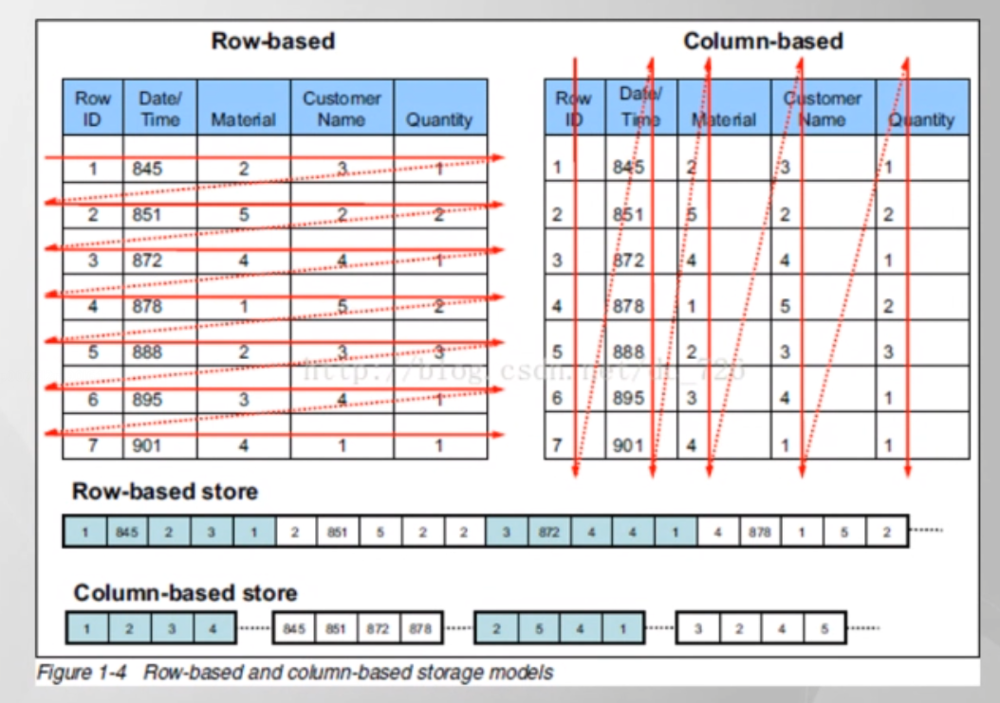
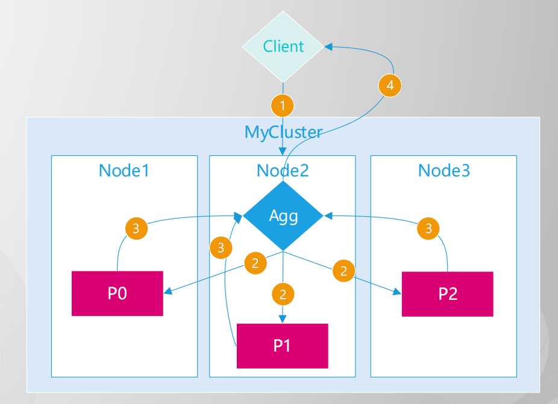

# Aggregations

只有支持doc_values(列式存储的排序)的字段才能进行聚合排序操作


## 列式存储的排序

**doc_values**(为了解决随意数据的排序/聚合)

es默认储存2份数据. 原始数据一份, 列式储存一份.

原始数据用于检索, 列式存储用于聚合排序. doc_values禁用则意味着该列不能用于聚合排序操作.

text, annotated_text等大文本字段没有列式储存




## 聚合执行过程

1. 客户端**发送**聚合请求
2. 协调节点**分发**聚合请求
3. 协调节点合并聚合**结果**
4. 协调节点返回聚合**结果**




### 一般用法

聚合的字段最好确保在所有文档中都存在, 如果不存在则最好个`missing`

**aggs可以与query和suggest结合**

```json
GET kibana_sample_data_ecommerce/_search
{
  "track_total_hits": true,
  "size": 1, // 一般是0 
  "aggs": {
    "sum_price": { // 聚合的列名
      "sum": { // 使用的聚合方法
        "field": "products.price", // 要聚合的列
        "missing": 0
      }
    },
    "max_price": {
      "max": {
        "field": "products.price"
      }
    }
  }
}

// 返回
{
  "took" : 11,
  "timed_out" : false,
  "_shards" : {
    "total" : 1,
    "successful" : 1,
    "skipped" : 0,
    "failed" : 0
  },
  "hits" : "...",
  "aggregations" : {
    "max_price" : {
      "value" : 1080.0
    },
    "sum_price" : {
      "value" : 350882.359375
    }
  }
}
```


## 聚合类型划分

[官网Aggregations](https://www.elastic.co/guide/en/elasticsearch/reference/8.2/search-aggregations.html)

* 数值指标聚合(metric)
* 分桶分组聚合(bucket)
* 管道二次聚合(pipeline)


