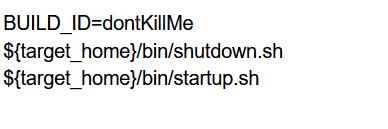

# jenkins 子进程后台运行

[官方](https://wiki.jenkins.io/display/JENKINS/Spawning+processes+from+build)

[中文](http://doc.okbase.net/147181/archive/98776.html)


旧版本直接在jenkins 命令行里增加` BUILD_ID=dontKillMe` 就可以了




新版本的需要使用`daemonize` 这个命令

1.  安装 `daemonize`

    ```shell
    yum install daemonize
    ```
    
2.  在脚本的启动命令中使用`daemonize` 

    ```shell
    daemonize -E BUILD_ID=dontKillMe {command}
    ```

3.  要注意的是

    1.  如果需要在指定目录运行 则需要添加`-c {dir}` 参数

    2.  命令不能使用全局命令, 需要使用绝对路径, 如

        ```shell
        gitbook serve --port 4000 --lrport 35730
        # 应该改为
        /usr/lib/node_modules/gitbook-cli/bin/gitbook.js serve --port 4000 --lrport 35730
        ```

        要找到目录的绝对路径可以使用 `which` 命令

        


