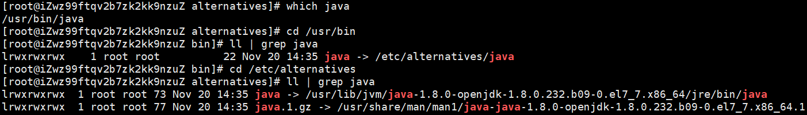

# jenkins 子进程后台运行

[文档](http://doc.okbase.net/147181/archive/98776.html)

[Jenkins杀死子进程处理方法](https://blog.csdn.net/yh88356656/article/details/108380923)


有2种方法, 一种是在在环境变量中配置不杀死子进程, 一种是用`daemonize`


## 环境变量

系统管理 > 系统配置 > 全局属性 > 环境变量

**BUILD_ID=DONOTKILLME**


## daemonize

1.  安装 `daemonize`

    ```shell
    yum install daemonize
    ```
    
2.  在脚本的启动命令中使用`daemonize` 

    ```shell
    daemonize -E BUILD_ID=dontKillMe {command}
    ```

3.  要注意的是

    1.  如果需要在指定目录运行 则需要添加`-c {dir}` 参数

    2.  命令不能使用全局命令, 需要使用绝对路径, 如

        ```shell
        gitbook serve --port 4000 --lrport 35730
        # 应该改为
        /usr/lib/node_modules/gitbook-cli/bin/gitbook.js serve --port 4000 --lrport 35730
        ```

        要找到目录的绝对路径可以使用 `which` 命令

        

