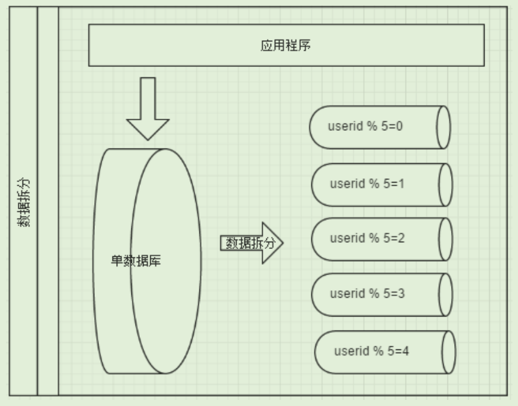

# 垂直切分&水平切分

[mycat文档](http://www.mycat.io/document/mycat-definitive-guide.pdf)

[聊一聊分库分表及它生产的一些概念](https://yq.aliyun.com/articles/740338)

## 垂直切分

垂直切分可以分为: **垂直分库** 和 **垂直分表**

### 垂直分库

一个数据库由多个表组成, 每个表对应着不用的业务

垂直分库是指**按业务将表进行分类**, 分布到不同的数据库上

### 垂直分表

一个表由多个字段组成, 一些字段比较常用(如商品表的名字和价格), 一些字段比较少用(规格之类的). 将热点数据和普通数据进行分离, 可以在一定程度上减少IO, 减轻数据量过大造成的跨页, 在相同内存中加载更多的数据

垂直分表是指**按字段的热门程度**, 分布到不同的表上

### 垂直切分优缺点

1.  优点
    *   拆分后业务清晰, 规则明确
    *   系统整合和扩展容易
    *   数据维护简单
2.  缺点
    *   部分业务表会非常庞大(仍然存在单库瓶颈), 不易数据拓展和性能提高
    *   部分业务无法join表, 只能通过接口查询, 提高系统复杂度
    *   事务处理复杂

## 水平切分

相对于垂直切分, 水平切分不是将表做分类, 而是**按照某个字段的某种规则**将数据分散到多个数据库中

水平切分又分为: **库内分表** 和 **分库分表**

### 库内分表

在同一个库内建立2个相同的表, 按照一定规则将数据分发到2个表中

库内分表主要解决并发访问不高, 但是数据量很多(达到数据库极限)的情况, 不能用于并发高的情况是因为用的还是同一个数据库. 该主机的CPU、IO、内存、数据库的连接数并没有提升

### 分库分表

在另一个库内建立一个和源库相同的表, 按照一定规则将数据分发到2个表中

与库内分表相比多了一台机器负载明细提升,

>   经典分片规则包括:
>
>   1.  按用户id求模 
>   2.  按日期, 将不同年月日的数据插入分散到不同数据库中
>   3.  某个字段求模, 或者根据特地范围分散到不同数据库中

### 水平切分优缺点

1.  优点
    *   拆分规则抽象好join操作基本可以数据库做
    *   不存在单库数据量过大, 高并发瓶颈
    *   系统负载和稳定性会有一定提高
2.  缺点
    *   拆分规则难以抽象
    *   分片事务一致性难以解决
    *   数据多次拓展难度和**维护量极大**
    *   夸库join性能较大

## 共同缺点

前面讲了垂直切分跟水平切分的不同跟优缺点，会发现每种切分方式都有缺点，但共同的特点缺点有

*   都需要引入分布式事务
*   跨节点join
*   跨节点排序分页
*   多数据源管理

## 切分原则

1.  能不切分尽量不切分, 1000w基本的表可以通过读写分离, 索引等提高性能
2.  如果需要切分一定要提前规划好切分规则
3.  分片数量要尽量少(分片查询越多越慢), 数据尽可能均匀分布在多个数据库上
4.  据切分尽量通过数据冗余或表分组（Table Group）来降低跨库 Join 的可能
5.  中间件对join的实现难以把控, 所以尽量少用join
6.  查询条件避免select *

