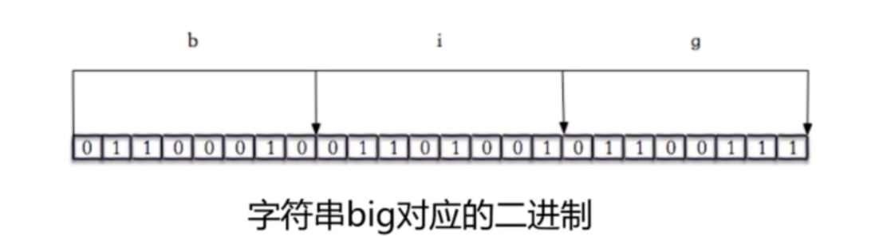

# 位图-Bitmaps

位图并不是实际的数据类型

实际类型是String, 所以最大可以保存512M

而是定义在String类型上的一个面向字节操作的集合(直接操作bit)。

位图的最大优势之一在存储信息时极其节约空间(只存0/1)。

设置时候时间复杂度O(1)、读取时候时间复杂度O(n)，操作是非常快的


## 位图与String

下图是字符串 big 的位图(01100010 01101001 01100111)

通过操作位图可以修改值

如: setbit key 7 1 (把第7位的值改为1). 那么big就会变为cig (一般谁这样搞啊...)




## 命令

```shell
# 给指定key的下标设置值(直接操作索引对应的bit)(如果offset设置为很大,中间的会补0)
setbit {key} {offset} {value}

# 获取指定key对应索引的值
getbit {key} {offset}

# 获取指定索引内值为1的个数, 这里有个坑看下面
bitcount {key} [start] [end]

# 对多个位图执行交并补等操作
# op = and(交集), or(并集), not(非), xor(异或)
bitop {op} {destkey} {key...}

# 查询指定字符里value首次出现的位置没有返回-1, start/end也是指定字节
bitpos {key} {value} [start] [end]
```

>   bitcount的坑
>
>   start和end是按照1byte算的, 就是说
>
>   `setbit key 0 1` `setbit key 0 1`
>
>   这时候执行 `bitcount {key} 0 0` 输出的是 2


## 位图的实际用途

记录全体非真即假的状态变化

如: 记录全体用户的签到, 用户是否在线. 设备模块的模块是否故障


## 拓展

如果你的 bitmap 数据非常大，那么可以考虑使用以下两种方法：

-   将一个大的 bitmap 分散到不同的 key 中，作为小的 bitmap 来处理。使用 Lua 脚本可以很方便地完成这一工作。
-   使用 `BITCOUNT` 的 start 和 end 参数，每次只对所需的部分位进行计算，将位的累积工作(accumulating)放到客户端进行，并且对结果进行缓存 (caching)。


位图在总数据大, 可是记录样本少时会导致有大量的0, 而且0也是占用内存和计算时间的

redis 有一个模块 [咆哮位图](https://juejin.im/post/5cf5c817e51d454fbf5409b0) [github](https://github.com/aviggiano/redis-roaring) 可以将位图中大范围的0转为偏移量储存, 

