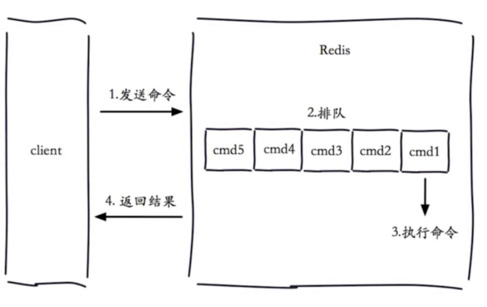
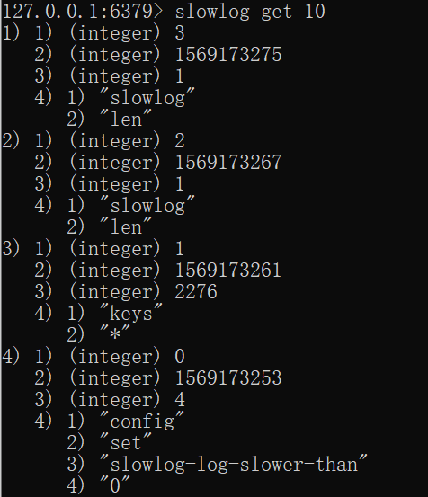

# 慢查询日志记录

redis内可以维护一个慢查询列表, 里面记录了慢查询命令. 

慢查询列表

*   先进先出队列
*   固定长度
*   保存在内存中(重启丢失)


## redis查询的生命周期



慢查询发生在第三个阶段


## 相关命令

```shell
# 获取慢查询队列长度 默认值128
config get slowlog-max-len
# 获取慢查询队列的记录阈值(单位微妙) 默认值10000(10毫秒)
config get slowlog-log-slower-than 

# 可以修改配置文件然后重启, 也可以通过命令动态设置然后用config rewrite重写到配置文件
# 设置慢查询队列长度(建议1000,看情况)
config set slowlog-max-len {value}
# 设置慢查询队列的记录阈值(设置为0记录 所有 命令, 小于0则不记录 | 建议10000(1毫秒)看情况)
config set slowlog-log-slower-than {value}

# 获取慢查询队列
slowlog get {value}
# 获取慢查询队列长度
slowlog len
# 清空慢查询队列
slowlog reset
```


## 慢查询日志结构

*   慢查询记录 id(队列的下标?)
*   发起命令的时间戳
*   命令耗时，单位为微秒
*   该条记录的命令及参数




## 慢查询日志持久化

可以通过定期检查`slowlog len` 长度, 如果不为0就执行`slowlog  get` , 把慢查询持久化到数据库中

日志收集logstash应该可以做

日后可以研究研究

