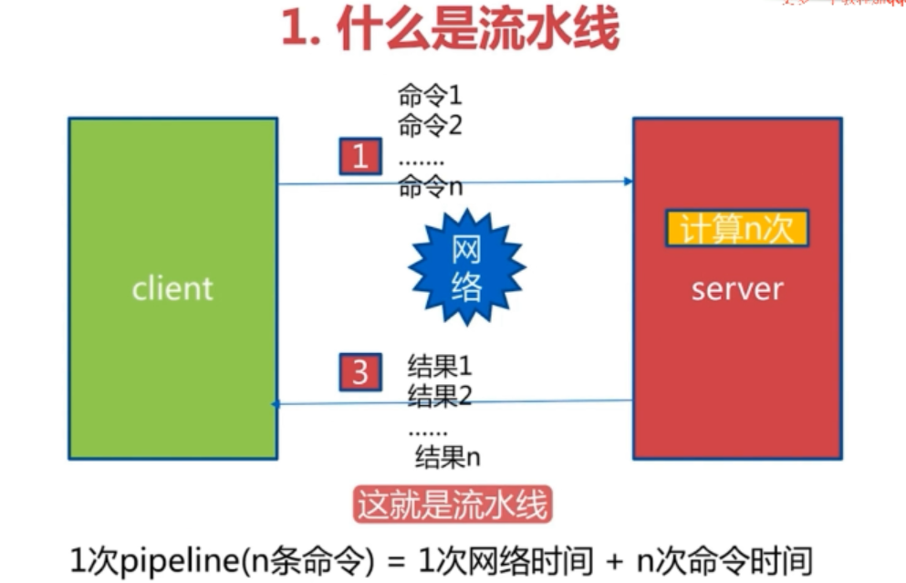

# 管道

允许redis将多条命令打包一次性发送给redis

好处是一些频繁的操作打包发送可以节省网络通讯时间




## m操作

m操作(mget之类) 是原子的, pipeline是可以拆分的


## 注意

pipeline只能用于单实例redis

打包的过去的命令是非原子的, 中间可以会穿插其他命令一起执行, 但返回不受影响


## 使用建议

注意每次pipeline携带的数据量

使用pipeline是为了节约等待网络的时间, 如果将大批量的数据一次性传输到redis会对网络资源和客户端等待时间造成影响(有时间可以测测性能衰减, 找出最优的) (如果中间有个keys * 凉凉~)


## 使用

```java
// redis 普通hset
private static void jedis() {
    StopWatch sw = new StopWatch();
    Jedis jedis = new Jedis();
    sw.start();
    for (int i = 0; i < 1000; i++) {
        jedis.hset("jedis", String.valueOf(i), String.valueOf(i));
    }
    sw.stop();
    System.out.println(sw.getTotalTimeSeconds());
}

// redis pipeline
private static void jedisPipeline() {
    StopWatch sw = new StopWatch();

    Jedis jedis = new Jedis();
    redis.clients.jedis.Pipeline pipelined = jedis.pipelined();
    sw.start();
    for (int i = 0; i < 1000; i++) {
        pipelined.hset("jedis-pipeline", String.valueOf(i), String.valueOf(i));
    }
    pipelined.syncAndReturnAll();
    sw.stop();
    System.out.println(sw.getTotalTimeSeconds());
}

// spring redis是用pipeline
private static void templatePipeline() {
    StopWatch sw = new StopWatch();

    RedisTemplate template = new RedisTemplate();
    sw.start();
    List<Object> resultList = template.executePipelined(new RedisCallback<Object>() {
        @Override
        public String doInRedis(RedisConnection connection)  {
            // 2.connection 打开管道
            connection.openPipeline();	
            
            // 3.connection 给本次管道内添加 要一次性执行的多条命令
            byte[] key = "template-pipeline".getBytes();
            for (int i = 0; i < 1000; i++) {
                byte[] bytes = String.valueOf(i).getBytes();
                connection.hSet(key, bytes, bytes);
            }

			// 3.3一个get操作
            connection.hGet(key, String.valueOf(1).getBytes());

			// 4.关闭管道 不需要close 否则拿不到返回值
			// connection.closePipeline();

			// 这里一定要返回null，最终pipeline的执行结果，才会返回给最外层
            return null;
        }
    });

    sw.stop();
    // 5.最后对redis pipeline管道操作返回结果进行判断和业务补偿
    for (Object str : resultList) {
        System.out.println(str);
    }
        System.out.println(sw.getTotalTimeSeconds());
}
```


最后的结果是

>   普通hset: 0.144
>
>   pipeline hset: 0.027
>
>   spring的没有试= =


用的是本地redis, 通讯可以说相当快了, 可是普通的hset还是比pipeline慢了5倍多!

