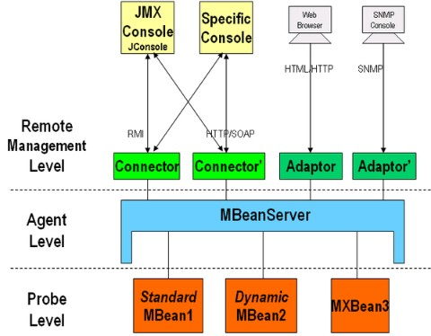
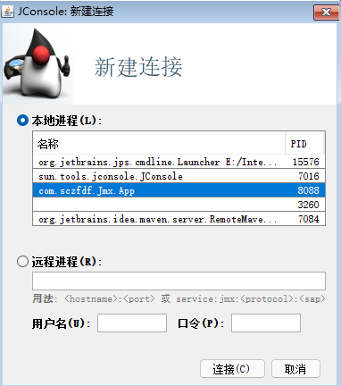
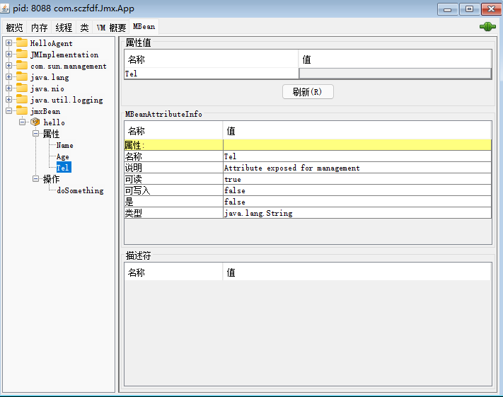

# JMX

JMX即Java Management Extensions(java管理拓展)

JMX是一套标准的代理和服务, 可以在任何Java应用程序中使用这些代理和服务实现管理.

> 可以构建一个或多个MBean对象, 用作配置. 在外部修改这些对象从而达到动态修改

不过...现在是云服务的时代. 单体的JVM监控已经不够了, 而且配置起来挺繁琐的...

​		

[JMX超详细解读](http://www.javashuo.com/article/p-ynnsogmp-a.html)

[Spring 与JMX](https://blog.csdn.net/qq_27870421/article/details/100110995)

[JMX 入门(三)认证加密](https://blog.csdn.net/isea533/article/details/77600542)

[設定 JMX 並使用 SSL](https://www.ibm.com/docs/zh-tw/elm/6.0.2?topic=tomcat-option-setting-up-jmx-ssl)

​		

## JMX架构



从图上可以看出JMX架构分为3层

顶部是暴露的远程控制层

中部是MBean服务

底部是各种MBean(探针)

​		

程序可以定制各种Mbean. Mbean注册到MBeanServer统一管理. 

外部可以通过各种协议访问MBeanServer查看或修改MBean


## MBean种类

| 类型           | 描述                                                         |
| -------------- | ------------------------------------------------------------ |
| standard MBean | 最简单的MBean. 命名需要依赖特定规则(接口为XXMBean, 实现类XX). 他所管理的资源必须定义在接口中 |
| dynamic MBean  | 必须实现javax.management.DynamicMBean接口，全部的属性，方法都在运行时定义 |
| open MBean     | 开放MBean是一种特殊的动态MBean，其属性和方法只限定于原始类型、原始类型的包装类以及可以分解为原始类型或原始类型包装类的任意类型； |
| model MBean    | 与标准和动态MBean相比，你能够不用写MBean类，只需使用javax.management.modelmbean.RequiredModelMBean便可。RequiredModelMBean实现了ModelMBean接口，而ModelMBean扩展了DynamicMBean接口，所以与DynamicMBean类似，Model  MBean的管理资源也是在运行时定义的。与DynamicMBean不一样的是，DynamicMBean管理的资源通常定义在DynamicMBean中（运行时才决定管理那些资源），而model MBean管理的资源并不在MBean中，而是在外部（一般是一个类），只有在运行时，才经过set方法将其加入到model  MBean中。后面的例子会有详细介绍 |


## 简单示例

standard MBean

```java
// standard MBean接口和实现类必须在同一个包下, 并且不能是内部类
public interface HelloMBean {
    String getName();
    void setName(String name);
    String getAge();
    void setAge(String age);
    // 这里没有setTel
    String getTel();
    String doSomething(String tel);
}

@Data
public class Hello implements HelloMBean {
    private String name;
    private String age;
    private String tel;

    @Override
    public String doSomething(String tel) {
        System.out.println("doSomething:" + tel);
        this.tel = tel;
        return tel;
    }
}

public class App {
    public static void main(String[] args) throws Exception {
        // 获取一个服务
        MBeanServer server = ManagementFactory.getPlatformMBeanServer();
        
        // 将一个新的Hello对象注册到MbeanServer, 命名为hello
        server.registerMBean(new Hello(), new ObjectName("jmxBean:name=hello"));

        Thread.sleep(Integer.MAX_VALUE);
    }
}
```

使用JConsole查看





Name和Age是可以修改和查看更新的, Tel只能查看. 但可以通过`doSomething(tel)`设置.

可以看出standard MBean就是普通的JavaBean规则. 底层猜测是注册的时候用JDK代理重新生成了一个Hello对象


## 使用网页查看JMX

下载jmxtools.jar并引入(因为有版权问题大部分maven都下架了)

```xml
<dependency>
    <groupId>com.sun.jdmk</groupId>
    <artifactId>jmxtools</artifactId>
    <version>1.2.1</version>
    <scope>system</scope>
    <systemPath>${project.basedir}/src/main/resources/lib/jmxtools.jar</systemPath>
</dependency>
```

在代码中开启

```java
public static void main(String[] args) throws Exception {
    MBeanServer server = ManagementFactory.getPlatformMBeanServer();
	HtmlAdaptorServer adapter = new HtmlAdaptorServer();
	server.registerMBean(adapter, new ObjectName("HelloAgent:name=htmladapter,port=8082"));
	adapter.start();
}
```


## 加密JMX链接

```shell
# 其中ssl是需要关闭的, 不然链接不上. SSL开启需要有SSL
# password文件需要赋权
# win:cacls jmx.password /P 当前用户:R
# linux: chown user:user 将文件设置为当前用户. chmod 400 jmx.password 设置只读权限
-Dcom.sun.management.jmxremote.authenticate=true
-Dcom.sun.management.jmxremote=true
-Dcom.sun.management.jmxremote.port=9999
-Dcom.sun.management.jmxremote.ssl=false
-Dcom.sun.management.jmxremote.access.file=E:\学习\myTest\unit-test\test1\src\main\resources\jmx.access
-Dcom.sun.management.jmxremote.password.file=E:\学习\myTest\unit-test\test1\src\main\resources\jmx.password

# ssl开启需要以下2个配置
# -Djavax.net.ssl.keyStorePassword=ibm-team
# -Djavax.net.ssl.keyStore=tomcat/ibm-team-ssl.keystore
```


