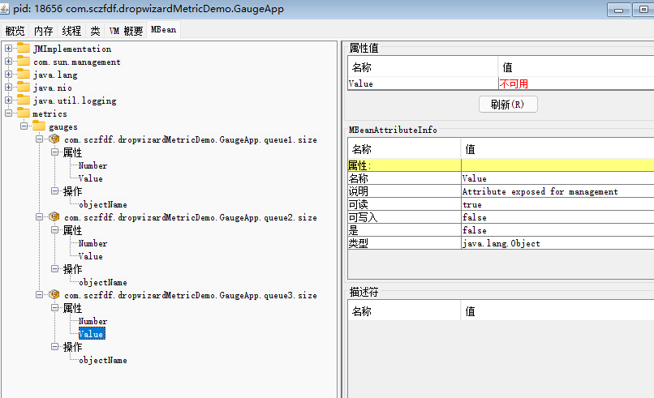

# Metrics

[Java Metrics系统性能监控工具](https://www.jianshu.com/p/e5bba03fd64f)

​		

Metrics提供了一个强大的工具包, 用于衡量生产环境中关键组件的行为, 并可以通过CSV, LOG等持久化

​		

## 基本类型

* **Gauge** 计量器 (保存一个对象)
* **Counter** 计数器 (保存一个计数器)
* **Meter** 度量器 (保存一个计数器, 并统计出15分钟内的访问速率)
* **Histogram** 直方图 (统计数据的分布情况. 最大值, 最小值. 百分比....)
* **Timers** 计时器 (统计某块代码的执行时间以及分布情况. 基于Meter和Histogram实现)


## 输出

原生core包自带3个输出, `ConsoleReporter`, `CsvReporter`, `Slf4jReporter`

可以自己继承`ScheduledReporter`来实现

> 注意下`CsvReporter`需要传递一个目录而不是文件

Metrics有很多增强型的依赖如: `metrics-jmx`, `metrics-jetty9`, `metrics-json`, `metrics-jvm`....可以为各种场景提供支持


## 示例代码

Gauge

```java
public class GaugeApp {
    public static Queue<String> q1 = new LinkedList<>();

    public static void main(String[] args) throws InterruptedException {
        MetricRegistry metricRegistry = new MetricRegistry();
        ConsoleReporter reporter = ConsoleReporter.forRegistry(metricRegistry).build();

        reporter.start(1, TimeUnit.SECONDS);

        metricRegistry.register(MetricRegistry.name(GaugeApp.class.getName(), "queue1", "size"),
                (Gauge<Integer>) () -> q1.size());

        metricRegistry.register(MetricRegistry.name(GaugeApp.class.getName(), "queue3", "size"),
                (Gauge<Object>) () ->  new User("user", "password"));

        while (true) {
            q1.add("q1");
            Thread.sleep(1000);
        }
    }

    @Data
    static class User{
        private String name;
        private String password;

        public User(String name, String password) {
            this.name = name;
            this.password = password;
        }
    }
}
```

​		

Meters

```java
public class MetersApp {
    public static void main(String[] args) throws InterruptedException, IOException {
        MetricRegistry metricRegistry = new MetricRegistry();
        Slf4jReporter reporter = Slf4jReporter.forRegistry(metricRegistry).build();

        Meter meter1 = metricRegistry.meter(
            MetricRegistry.name(GaugeApp.class.getName(), "request1", "rate"));

        int x = 10;
        while (true) {
            for (int i = 0; i < RandomUtils.nextInt(0, 3); i++) {
                meter1.mark();
            }
            Thread.sleep(100);

            if (x-- <= 0) {
                x = 10;
                reporter.report();
            }
        }
    }
}
```

​		

Histogram

```java
public class HistogramApp {
    public static void main(String[] args) throws InterruptedException {
        MetricRegistry registry = new MetricRegistry();
        ConsoleReporter reporter = ConsoleReporter.forRegistry(registry).build();

        reporter.start(1, TimeUnit.SECONDS);

        Histogram histogram = new Histogram(new ExponentiallyDecayingReservoir());
        registry.register(MetricRegistry.name(HistogramApp.class, "request", "histogram"), histogram);

        while (true) {
            Thread.sleep(1000);
            histogram.update(RandomUtils.nextInt(1, 100));
        }
    }
}
```

​		

Timers

```java
public class TimersApp {
    public static void main(String[] args) throws InterruptedException {
        MetricRegistry registry = new MetricRegistry();
        ConsoleReporter reporter = ConsoleReporter.forRegistry(registry).build();
        reporter.start(1, TimeUnit.SECONDS);

        Timer timer = registry.timer(MetricRegistry.name(TimersApp.class, "get-latency"));

        Timer.Context ctx;

        while (true)
        {
            ctx = timer.time();
            Thread.sleep(RandomUtils.nextInt(500, 1000));
            ctx.stop();
        }
    }
}
```

​		

## 发布到JMX

引入依赖包

```xml
<dependency>
    <groupId>io.dropwizard.metrics</groupId>
    <artifactId>metrics-jmx</artifactId>
    <version>4.2.0</version>
</dependency>
```

输出到jmx

```java
JmxReporter reporter = JmxReporter.forRegistry(metricRegistry).build();
reporter.start();
```

结果

> 值得注意的是jmx不能输出对象




## 转为json格式

引入json支持包

```xml
<dependency>
    <groupId>io.dropwizard.metrics</groupId>
    <artifactId>metrics-json</artifactId>
    <version>4.2.0</version>
</dependency>
```

json格式化

```java
MetricsModule metricsModule = new MetricsModule(TimeUnit.SECONDS, TimeUnit.SECONDS, true);
ObjectMapper objectMapper = new ObjectMapper();
objectMapper.registerModule(metricsModule);

SortedMap<String, Meter> meters = metricRegistry.getMeters();
for (Meter meter : meters.values()) {
    // 使用objectMapper这个对象就可以正确格式化Metrics的类型
    System.out.println(objectMapper.writeValueAsString(meter));
}
```


