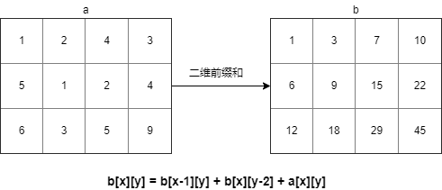

# 前缀和, 差分, 二维前缀和

[前缀和&差分](http://wiki.edwiv.com/basic/prefix-sum/#_1)

[线段树(简单高效的区间操作)](https://blog.csdn.net/weixin_43843835/article/details/88750190#_1)

[前缀和、二维前缀和与差分的小总结](https://blog.csdn.net/k_r_forever/article/details/81775899)

对于一般数组的区间求和时间复杂度是O(n), 更新是O(1)

对于前缀和数组区间求和时间复杂度是O(1), 更新是O(n)


## 例子

a=[1, 3, 5, 6, 8, 12, 29]


## 前缀和

**前缀和顾名思义就是前面i个数的总和**

>   前缀和是一种重要的预处理，能大大降低查询的时间复杂度。可以简单理解为“数列的前 n 项的和” 

例子中的a 的前缀合为: 

b=[1, 4, 9, 15, 23, 35, 64]

前缀和录入需要遍历原数组, 公式为: 

**b[n] = a[n] + b[n-1] (n>1)**


## 差分

**将对区间的操作储存起来, 在计算时统一操作**

>    (感觉和数学上的差分不是一个东西博客上也没具体说明, 这是总结的)

如: 要在区间[1, 3]中添加10

第一步, 先要创建一个和a 同等大小的数组 c

第二步, 设置c[1] = 10, c[3+1] = -10

>   先记住这样用, 具体怎么用下面说(问题2)


>   差分的局限在于只能在求前缀和之前用, 如果求前缀和后对区间的操作复杂度就会提升


## 二维前缀和

**前缀和的二维表现**

二维前缀和也是可以用差分的, 只是二维每一次操作需要记录4个位置(感觉用的少少少. 用到在看参考)




## 区间操作

### 问题1: 求a中区间[2-5]的元素和

1.  **普通解法**
    遍历a, 当a[2-5]时获取元素并相加

2.  **前缀和**

    遍历a, 获取前缀和数组b. b[5] - b[1]即为结果


### 问题2: 将a中区间[2-5]的元素加上10, 再获取[2-5]元素和

1.  **普通解法**

  

2.  **前缀和+差分**

    1.  创建数组c, 设置c[2] = 10, c[6]=-10

    2.  创建前缀和数组时, 将c添加进去

        ```java
        for(i=1;i<=n;i++){
            // 注意add是叠加c的, 因为c[6]不需要添加, 所以要设置为-10
            // 差分服务于前缀和
        	add+=c[i]; 
        	a[i]+=a[i-1]+add;
        }
        ```

    3.  获取结果

    >   详细题目和解法可以看参考


### 问题3: 若已知a中元素最大值为29,且元素均大于0. 求元素8在数组中比多少个元素大

 1.    **普通解法**

       排序后, 遍历元素, 并记录个数, 直至遇到8

2. **二分法**
    排序, 每次取数组中间值, 若大于8则下次从右侧选取中间值, 反之

    直到找到元素8. 然后判断是否前一个是8, 如果不是则获取下标

3. **前缀和**

    因为已知元素最大值为29, 创建数组b(b元素容量为29)

    遍历a, 设置b的值为 **b[a[i]]++** 

    >   按照例子中的a, 此时b的数值为
    >
    >   [0, 1, 0, 1, 0, 1, 1, 0, 1, 0, 0, 0, 1, 0, 0, 0, 0, 0, 0, 0, 0, 0, 0, 0, 0, 0, 0, 1 ] (大概就这样...)

    获取b 的前缀和

    >   此时b变成了
    >
    >   [0, 1, 1, 2, 2, 3, 4, 4, 5, 5, 5, 5, 6, 6, 6, 6, 6, 6, 6, 6, 6, 6, 6, 6, 6, 6, 6, 7 ] 

    元素8在数组中排第5(b[8]) 所以, 8在元素中比4个元素大


## 问题4: 


