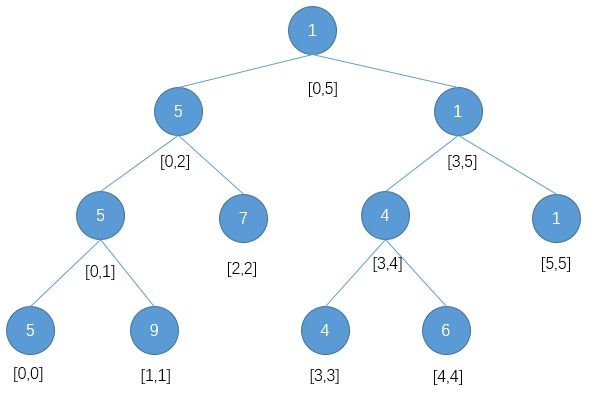

# 线段树

[知乎-史上最详细线段树教程](https://zhuanlan.zhihu.com/p/34150142)

[线段树详解](https://blog.csdn.net/huangzihaoal/article/details/81813454#_2)

[线段树从零开始](https://blog.csdn.net/zearot/article/details/52280189)


## 什么是线段树

1.  一种储存区间信息的二叉搜索树

2.  由下面线段树{5,9,7,4,6,1}可得
    *   线段树基本思想是 **二分**
    *   每个节点必定包含着一个区间
    *   每个节点的 **左孩子区间范围** 为[l，mid]，**右孩子区间范围** 为[mid+1,r]
    *   对于结点k，左孩子结点为2\*k，右孩子为2*k+1 (二叉树的性质, 对于不存在的节点用特殊标识, 快速寻找子节点)
    
    
    
3.  区间的值(蓝色圆圈的数字) 可以是最大值/最小值/和


## 线段树优势

### 区间求和 (O(logn))

如果线段树保存的是区间和, 在寻找特定区间的区间和就会比数组直接区间求和快(O(logn) O(n))

如: 寻找[2,5]的区间和 

1.  寻找区间中值(2)
2.  发现右区间[3,5]被区间[2,5]包含, 区间[2,5]变成[2,2]+[3,5]
3.  在左区间[0,2]寻找节点[2].  寻找中值(1), 找到右区间[2,2]就是目标区间


### 点更新 (O(logn))

因为更新的是叶子节点, 叶子节点的修改会影响到区间. 所以要修改所包含的区间

如: 修改数组下标[4]的值

1.  寻找区间中值(2)
2.  发现右区间[3,5]包含节点[4], 再寻找中值(4)
3.  发现左区间[3,4]包含节点[4], 寻找中值(3)
4.  发现节点[3],[4]没有叶子节点, 并且找到节点[4], 修改节点, 并且更新区间


## 构造线段树

可以构造2种线段树

1.  一种是构造完全二叉树的线段树, 如果区间没有子节点就补充一个默认节点. 

    好处是可以运用一些完全二叉树的特性

    

2.  一种就是普通的线段树


### 构造

1.  节点/区间实体

    ```java
    @Data
    public class Node {
        /**
         * 区间的左端点
         */
        private int start;
        /**
         * 区间的右端点
         */
        private int end;
        /**
         * 该节点的值
         */
        private int data;
        /**
         * 延迟更新的标记
         */
        private int mark = 0;
    
        /**
         * 构造方法中传入左端点和右端点
         * @param start start
         * @param end end
         */
        public Node(int start,int end) {
            this.start = start;
            this.end = end;
        }
    
        /**
         * 做标记
         * @param value value
         */
        void addMark(int value) {
            this.mark+=value;
        }
        void clearMark()
        {
            this.mark = 0;
        }
    }
    ```

    

2.  构建树(base,nodes要放在构建树的类上, main和上面的实体是放在node.java里的)

    ```java
    public static void main(String[] args) {
            Node node = new Node(0,0);
    
            node.build(0);
    
            System.out.println(node);
        }
    
        /**
         * 基础数组中有六个点
         */
        int[] base = {5, 9, 7, 4, 6, 1};
        /**
         * 存储线段树的数组
         */
        Node[] nodes = new Node[(base.length << 1) + 2];
    
        /**
         * 构造一颗线段树，传入下标
         * @param index index
         */
        private void build(int index) {
            // 取出该下标下的节点
            Node node = nodes[index];
            if (node == null) {
                // 根节点需要手动创建
                nodes[index] = new Node(0, this.base.length - 1);
                node = nodes[index];
            }
    
            if (node.start == node.end) {
                // 如果这个线段的左端点等于右端点则这个点是叶子节点
                node.data = base[node.start];
            }
            else {
                // 否则递归构造左右子树
    
                // 现在这个线段的中点
                int mid = (node.start + node.end) >> 1;
    
                // 左孩子线段
                nodes[(index << 1) + 1] = new Node(node.start, mid);
                // 右孩子线段
                nodes[(index << 1) + 2] = new Node(mid + 1, node.end);
                // 构造左孩子
                build((index << 1) + 1);
                // 构造右孩子
                build((index << 1) + 2);
                // 这个节点的值等于左右孩子中较小的那个
                node.data = Math.min(nodes[(index << 1) + 1].data, nodes[(index << 1) + 2].data);
            }
        }
    ```

